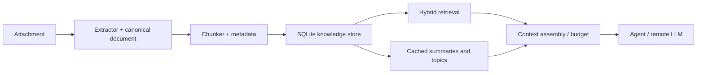

# EducAI Knowledge Architecture

Status: **IMPLEMENTED (K1–K6) — LINUX SEMANTIC RUNTIME HUMAN-PASS**; Windows Knowledge semantic runtime validation remains a separate future gate. Architecture design was approved in the bounded pass below; implementation, Linux runtime closure, and K6 hierarchical summarization closure are recorded in `CURRENT_CHECKPOINT.md`.

## 1. Context and problem

Conversations must be able to accept hundreds or thousands of TXT/Markdown documents while keeping durable knowledge local to the EducAI conversation. Remote models receive only the user request and a bounded, provenance-rich evidence package. Knowledge is owned by EducAI, not by a provider, an ephemeral OpenCode session, or a SaaS service.

## 2. Goals

- Local parsing, normalization, hashing, deduplication, chunking, embeddings, lexical/vector indexes, summaries, caches, and change tracking.
- Hybrid semantic + lexical retrieval with deterministic context budgeting.
- Incremental add/modify/delete and crash-safe restart/resume.
- Provenance suitable for UI citations and Creation generation.
- Cross-platform desktop packaging without a server or daemon.

## 3. Non-goals

This pass does not implement ingestion, PDF/DOCX/XLSX/OCR, a local generative model, UI, MCP, provider changes, or the HUMAN-PASS Creations flow. It does not reopen closed milestones and does not start M11.

## 4. Constraints and current integration boundary

The existing conversation, attachment, project-filesystem, OpenCode, and Creation contracts remain authoritative. Knowledge is a conversation/project-owned subsystem adjacent to attachments and outputs; attachments remain the source files and Creations continue through their existing flow. An adapter may later expose retrieval to an agent (native tool, local API/IPC, MCP, or another mechanism), but the domain API must not depend on MCP.

## 5. Overview



The public domain operations are `index_document`, `remove_document`, `search`, `assemble_context`, and `summarize_collection`; adapters translate attachments and agent requests into these operations.

## 6. Ingestion and canonical representation

An extractor registry maps media type to a parser. V1 has built-in TXT and Markdown parsers; future parsers (including a MarkItDown adapter) implement the same interface and are not architectural dependencies. A canonical document stores stable `document_id`, conversation/project id, source attachment id/path, content hash, byte size, media type, detected encoding, parser/version, created/modified times, and extraction warnings. Structured spans retain heading path, paragraph/list boundaries, transcript speaker and timestamp when present, and later page/sheet/range/section fields only when the parser actually knows them.

## 7. Chunking

Chunk by semantic boundaries: Markdown headings, paragraphs, list items, and transcript turns; then pack adjacent units to a configurable **target chunk size**. For the V1 `multilingual-e5-small` recommendation, target about 300–400 embedding-tokenizer tokens with a small boundary-aware overlap (about 10–15%). This target is not the maximum.

Every chunker must also enforce a **hard embedding input limit** derived from the active embedding generation/model contract. The limit is counted with that model's relevant tokenizer, not characters or whitespace-delimited words, and leaves any required margin for model-specific prefixes or formatting. A chunker may favor structural boundaries, but it must never emit an embedding input exceeding that hard limit. If a heading section, paragraph, list item, or speaker/timestamped turn is larger than the limit, split it deterministically into ordered sub-chunks while retaining the source document, structural parent, ordinal/position, and sub-chunk relationship in provenance. Thus V1 remains structure-aware rather than fixed-window chunking, with the model-aware limit as its upper constraint. Each chunk has a stable id derived from document hash, parser/chunker versions, ordinal, and normalized content hash. This permits parser-specific chunkers without changing retrieval contracts.

## 8. Embeddings

Recommended V1 model: **multilingual-e5-small**, CPU-friendly, multilingual Spanish/technical quality, and 384 dimensions. The immutable fp32 ONNX export, Rust tokenizer boundary, bundled ONNX Runtime CPU 1.22.0, first-use model download, artifact checksums, and platform loading/validation contract are accepted in [ADR-0016](decisions/0016-knowledge-local-inference-runtime-distribution.md). Package the runtime behind an embedding-provider interface and benchmark it on representative Spanish technical/transcript queries. Alternatives: `bge-m3` (better multilingual coverage, substantially larger/slower) and `multilingual-e5-base` (quality gain, higher resources).

Each embedding generation has a versioned model contract containing at least: model identifier; immutable model version/revision; tokenizer and tokenizer version where applicable; embedding dimensionality; maximum effective input tokens; input formatting contract; and normalization behavior. The chunker consumes this contract to calculate its hard limit. For the E5 family, the V1 contract must format inputs as `query: <user query>` for queries and `passage: <document chunk>` for document embeddings. These prefixes are part of embedding-generation configuration, not ad-hoc call-site behavior. Record this complete contract in every index generation.

Default distribution is a bundled, checksum-pinned ONNX Runtime CPU payload plus an optional first-use model download into an application-managed writable data directory; see [ADR-0016](decisions/0016-knowledge-local-inference-runtime-distribution.md). Downloads require HTTPS, a pinned manifest, checksums, atomic rename, and versioned directories. The manifest pins model ID, immutable revision, tokenizer/runtime compatibility, dimension, license notice, every file length and SHA-256. A model upgrade creates a new index generation and migrates/re-embeds in the background; old generations remain readable until success. This avoids inflating AppImage/NSIS with the model while preserving reproducibility and offline behavior after first use.

## 9. Embedded storage and indexes

Use one SQLite database per conversation/project under a private `knowledge/` directory, with WAL, foreign keys, transactional migrations and durable job state. Tables cover documents, spans, chunks, embeddings, lexical metadata, summaries, model/parser versions, failures and jobs. SQLite FTS5 handles lexical search (unicode-aware tokenization plus separately normalized exact identifier fields). FTS5 is an embedded full-text virtual table with ranking, phrase, prefix and proximity queries; see the [official SQLite FTS5 documentation](https://sqlite.org/fts5.html).

**V1 decision:** store fixed-dimension normalized vectors as BLOBs and search them in bounded, streaming Rust batches with exact cosine/dot-product scoring. This avoids an extra native extension/DLL while the target is tens of thousands of chunks; it must be benchmarked on representative Windows and Linux machines, not treated as a performance guarantee. `sqlite-vec` is a plausible V1.x adapter because it is dual Apache-2.0/MIT, pure C and cross-platform, but its own project states that it is pre-v1 and may make breaking changes. It is not a V1 dependency. [sqlite-vec project](https://github.com/asg017/sqlite-vec)

No PostgreSQL, Qdrant, Elasticsearch, Docker, or permanent service.

## 10. Hybrid retrieval and context assembly

Run lexical FTS and vector search in parallel. Merge ranked lists through reciprocal-rank fusion (RRF), rather than assuming BM25 and vector scores are directly comparable; boost exact normalized identifiers, source names, speakers and dates through explicit, testable rules. Deduplicate by content hash and diversify by source/document. Add a limited neighboring-chunk window only when it fits the budget. A future small multilingual local cross-encoder may rerank the already small merged set, but V1 does not add a second model/runtime.

### K3 implemented hybrid retrieval contract

K3 exposes one project-local `hybrid_search(query, optional_provider, options)` API. Its defaults return up to 10 candidates after bounded overfetch of 40 FTS5/BM25 and 40 active-generation exact-semantic candidates. Fusion is `sum(1 / (60 + rank))`; ties are resolved by best rank, lexical rank, semantic rank, document id, then chunk id. This deliberately does not calibrate BM25 against vector similarity.

Identifier-like tokens must contain letters and ASCII digits and may retain `-`, `_`, `:` or `/`; they are NFC-normalized and lowercased. An exact candidate occurrence receives the bounded post-RRF additive preference of 0.02, never replacing RRF. Natural-language-only queries receive no identifier boost. The fusion stage deduplicates a canonical chunk across both signals and alias sources, chooses a stable source representative, and applies conservative caps of three candidates per canonical document and three per source path.

K3 itself does not expand neighbors: direct retrieval results retain `neighbor_of: None`. K4 Context Assembly may add bounded same-document neighbors only after K3 selection, preserving the retrieval boundary. Missing local semantic capability returns lexical-only results with semantic availability marked unavailable; corrupt semantic data still follows K2's typed error/recovery path. Only ready vectors from the provider's active generation participate. There is no ANN, vector extension, reranker, persistent query state, or remote fallback. HYBRID RETRIEVAL REMOTE LLM CALLS: ZERO.

### K4 implemented context assembly contract

K4 consumes the already-bounded K3 `HybridSearchResult` list through `KnowledgeStore::assemble_context(query, candidates, options)`. The store first verifies each supplied chunk/document/source identity belongs to its active project, so a foreign project's candidates become no evidence. `ContextAssembler` performs no FTS or vector query; when enabled, the store supplies only immediate same-document ordinal neighbors for the selected K3 candidates. The result is a provider-independent structured `EvidencePackage`, not a prompt string and not an `AgentEngine` request.

`EvidencePackage` keeps query metadata separate from untrusted evidence text, the configured assembly options, ordered entries, and non-content totals. Each entry retains canonical document/chunk/source identity, source path/name, excerpt text, complete/trimmed status, adjusted provenance offsets/lines, heading and structural metadata, hybrid score/ranks, embedding generation, lexical/semantic/exact-ID/neighbor signals, and its estimated cost. It is therefore sufficient for future citation rendering without a database re-query. No evidence text, query text, or document contents are logged.

The hard budget applies to **evidence entries only**, not the user query. Its conservative local default is 3,000 units with a 300-unit reserve, leaving a usable evidence ceiling of 2,700 units for future system instructions, user input, framing, and answers. The default `BudgetEstimator` is deliberately not the E5 tokenizer: it estimates one unit per three UTF-8 bytes (rounded up) plus 24 fixed units per entry for source/provenance framing. This is a deterministic safety estimate, not a claim of exact remote-model tokenization. `estimated_budget_used <= estimated_budget_limit` is an invariant, including every emitted entry body and its fixed framing overhead.

Defaults also cap assembly at eight entries, two entries per document, two per source, 900 units per entry, and ten K3 candidates. A 64-unit minimum useful entry stops selection instead of emitting tiny fragments. Direct K3 candidates are selected in their deterministic fusion order first; canonical chunk/text duplicates and caps are defensively suppressed. Immediate neighbors have radius one by default, consume the same budget/caps, retain provenance, are marked `neighbor_of`, and are never considered until all direct candidates have had priority.

Oversize direct or neighbor chunks may become a `TruncatedExcerpt` only when a deterministic UTF-8-safe prefix can fit. Selection favors paragraph/sentence/list/whitespace boundaries; the entry is explicitly marked, and end offset/end line are narrowed to the included prefix rather than claiming the entire chunk. Empty K3 input returns a valid empty package. K3 lexical-only fallback and partial readiness remain valid inputs. Context Assembly has no schema change, persistence, reranker, summarizer, provider formatting, provider tokenizer, or remote fallback. CONTEXT ASSEMBLY REMOTE LLM CALLS: ZERO.

The FTS query builder must escape/tokenize raw user text rather than interpolate FTS syntax.

## 11. Question answering vs corpus summarization

**Question answering:** user question → intent detection (`NormalSemantic` vs `CorpusExhaustive`) → either bounded K3/K4 top-k hybrid retrieval **or** a local exhaustive presence scan of every READY chunk → ranked/compact evidence → remote LLM answer (with locally appended source filenames). A corpus-wide negative answer is produced locally only when `exhaustive_coverage=complete` after inspecting the full eligible READY inventory; top-k emptiness is never treated as global absence.

**Corpus summarization:** local extraction/chunking → cached per-document summaries or structured facts → topic/cluster summaries → hierarchical collection summary → optional remote synthesis of only intermediate summaries. Embeddings alone cannot produce faithful prose. V1 should use extractive/structured local aggregation and cache boundaries; a small local generative model is a later opt-in due to packaging and CPU cost. Remote synthesis is optional and auditable.

## 12. Incrementality, deduplication, and invalidation

Content hash identifies identical bytes; normalized-content hash detects renamed copies. Near-duplicate/embedded-transcript detection is deferred, with chunk-level hashes removing exact repeats. Add processes only new hashes. Modify invalidates extraction and descendants when content, parser version, schema, or chunker version changes. A change to any embedding-generation contract field—model, revision, tokenizer, input formatting, normalization, or dimensionality—creates a new vector generation and regenerates embeddings/vector index only; it does not require extraction or chunking when their content/configuration is unchanged. A chunker change regenerates chunks and their dependent FTS, embeddings/vector index, and summaries. Delete tombstones/removes document references and orphaned chunks transactionally. Jobs are resumable and keyed by document/version/chunker/model generation.

## 13. Provenance and privacy

Evidence carries source attachment, relative path/name, section/heading, speaker, timestamp, and future page/sheet/range fields when available, plus chunk id and character offsets. Local processing is the default privacy boundary. Only selected excerpts/intermediate summaries cross the provider boundary, and future UX should show indexed sources and what is being sent.

## 14. Accepted-turn processing and failure recovery

Knowledge does not autonomously process arbitrary background work. Pre-send
selection is non-durable UI state only: it creates no Material, project copy,
Knowledge database row, embedding, history entry, remote provider call, or
operation.

An explicitly accepted turn containing Materials may own one durable,
project-local import/index operation (ADR-0017). Its ledger is committed before
the first project-owned copy and records `accepted`, `copying`,
`indexing_lexical`, `indexing_embeddings`, `pending_retry`, or `completed` plus
truthful counters. SQLite and filesystem are deliberately separate durable
boundaries; no false cross-store atomicity is claimed. The user turn is persisted
before the operation ledger exposes `prepared > 0`, so `prepared > 0` always
implies a durable, linked `turn_id` (the first `copied > 0` write carries the
turn link). Materials retain their own durable Pending/Ready/Failed/Unsupported
Knowledge state.

On restart an incomplete operation is discoverable and stays recoverable
`pending_retry` until explicit retry; reopening never starts an always-running
worker or silently changes it to Ready. One bad document records a sanitized
per-Material error and does not poison independent work. Post-acceptance
cancellation is not supported because filesystem, Material, and derived state
cannot yet be rolled back atomically.

## 15. Performance expectations

For 100–1,000 text documents (tens of thousands of chunks), expect disk usage dominated by source text plus roughly `chunks × dimensions × 4` bytes for float32 vectors (about 1.5 KB per 384-d vector before indexes). Stream batches; do not load the full index into RAM. SQLite WAL and batched writes keep startup incremental; query latency should be dominated by bounded candidate scoring, with benchmarks required on representative hardware rather than guarantees.

## 16. Packaging implications

Linux AppImage remains portable: avoid glibc-sensitive services, ship/locate native runtime libraries beside the app, and validate against the controlled Ubuntu 24.04 / glibc ≤2.39 policy. Windows 11 x64 Tauri/NSIS needs no pre-gate product change: reserve a writable per-user model/cache directory, package any native DLLs beside the sidecar/app, and use the same signed manifest/checksum mechanism. Do not add a server or daemon. Confirm installer resource rules during the Windows runtime gate.

## 17. V1, V1.x, future

V1: TXT/Markdown, local extraction, structure-aware chunks, multilingual local embeddings, SQLite + FTS5 and portable vector interface, hybrid retrieval, provenance, incremental indexing, context assembly, and existing remote answer/Creation synthesis.

V1.x: PDF/DOCX/XLSX/PPTX/HTML adapters, better vector index/reranking, richer citations and collection/topic summaries.

Future: OCR, optional local generative summarization, advanced near-duplicate detection, distributed/large-corpus optimizations.

## 18. Alternatives and rejected approaches

Rejected sending the whole corpus, embeddings-only retrieval, provider-managed knowledge, mandatory MCP, MarkItDown-first design, and always-on database servers: each violates cost, exact-match, ownership, portability, or maintenance constraints. Qdrant/Elasticsearch/Postgres remain possible later only if measured scale disproves the embedded approach.

## 19. Open questions

- Final vector extension/license and benchmark threshold on Windows/Linux.
- Whether a signed bundled model is offered for offline-first editions.
- Exact context budgets and citation UX after retrieval telemetry.
- Whether local generative summarization meets resource and license requirements.

## 20. Implementation phases and validation

The accepted-turn lifecycle is implemented before the Windows runtime gate;
Windows Knowledge validation itself remains unchanged. Validate determinism,
add/modify/delete/restart behavior, provenance, privacy logging, corruption
recovery, 100/1,000-document benchmarks, offline operation, AppImage
portability, and Windows NSIS/runtime packaging at their respective gates.

## 21. Concrete project boundary and durable layout

The present layout is authoritative: a Conversación is a `Project`, immutable
original Materials are in `inputs/`, agent scratch is `workspace/`, Creations
are `outputs/`, and only `publish/` can be shared. Knowledge is a private,
derived sibling and must never be provisioned to the OpenCode workspace merely
because it exists:

```text
<app-data>/projects/<project-id>/
  project.json                 # existing conversation/material/Creation aggregate
  inputs/                      # existing immutable source bytes
  workspace/                   # existing OpenCode scratch, not knowledge
  outputs/                     # existing Creations
  publish/                     # existing public snapshot only
  knowledge/                   # proposed private derived data
    knowledge.sqlite           # metadata, FTS5, vectors, summaries, jobs
    staging/                   # recoverable same-tree temporary work
    generations/               # optional staged model/schema rebuilds
```

Model artifacts are global, versioned app data (for example
`<app-data>/knowledge-models/<model-id>/<revision>/`), never AppImage/NSIS
mount data or project data. `knowledge/` is deleted with the project by the
existing fail-closed deletion path. It is not a publish, preview, Creation or
OpenCode XDG tree.

The existing `AgentEngine` and attachment authorization remain untouched. A
future application service resolves an authorized project/Material request to
`search_knowledge`, `assemble_context` or `summarize_collection`, then passes
an `EvidencePackage` through an adapter to the agent. Native tool, local IPC,
local API and MCP are possible adapters later; none define the domain.

## 22. Concrete canonical representation and schema responsibilities

An `Extractor` port consumes an authorized Material stream plus a known media
type and produces normalized UTF-8 canonical text and ordered spans. V1 has
built-in TXT/Markdown extractors. Future parsers—built-in, a MarkItDown adapter
or another library—implement this port and are not a V1 dependency.

The document record stores project/document/Material identity, safe source
name and relative path, original SHA-256, normalized-content SHA-256, byte size,
media type, detected encoding/warnings, source timestamps when available, and
extractor/canonical-schema version. A span carries only parser-known fields:
offsets, heading path, paragraph/list boundary, transcript speaker/timestamp,
and later page, sheet/range or Word section. Chunks reference spans and retain
text, offsets, ordinal, normalized hash and chunker version.

Logical SQLite responsibilities are:

| Data | Purpose |
| --- | --- |
| `schema_meta`, `model_generations` | schema and complete embedding-generation contract compatibility (model/revision, tokenizer, dimensions, effective input limit, formatting, normalization) |
| `documents`, `document_versions`, `spans`, `chunks` | source linkage, canonical text and provenance |
| `chunk_fts`, `chunk_terms` | FTS5/BM25 text and normalized exact IDs/dates/names |
| `embeddings` | generation, dimension, normalized BLOB and chunk reference |
| `jobs`, `job_items`, `failures` | resumable index work and scoped failures |
| `summaries`, `summary_inputs` | cached intermediate summaries and invalidation graph |

## 23. Incrementality and failure detail

Original SHA-256 deduplicates identical bytes. A normalized-content hash detects
renamed/copy-equivalent text. Multiple Material records can reference one
canonical document so user-visible provenance is retained. Chunk hashes remove
exact repeated transcript content. Near-duplicate detection and quoted-history
suppression are deliberately deferred: their false-positive cost requires real
corpus evidence.

| Change | Reuse | Recompute |
| --- | --- | --- |
| New unique Material | none | extraction → chunks → FTS → embeddings → affected summaries |
| Source content changes | no descendant data | that document's extraction descendants and parent summaries |
| Rename/metadata-only change | canonical text/chunks/vectors | source link/display provenance only |
| Parser/schema change | original bytes | extraction and descendants for affected format |
| Chunker change | canonical document | chunks, FTS, vectors and summaries |
| Embedding model, revision, tokenizer, formatting, normalization, or dimensionality change | documents/chunks/FTS | new vector generation only |
| Summary algorithm change | source/index data | affected summary cache only |
| Delete | other sources | transactional source unlink and orphan cleanup |

Jobs are idempotent by document version, parser, chunker and model generation.
Corrupt/unsupported inputs and odd encodings produce scoped failure records;
missing models produce a retryable pending state; disk-full pauses safely;
interrupted writes roll back or resume; derived-index corruption is rebuilt from
`inputs/` after preserving/quarantining the bad derived data. One bad document
cannot poison a conversation.

## 24. Cost and privacy model

The following work is local: file reads, parsing/extraction, normalization,
hashing, deduplication, chunking, metadata, tokenization, embedding, SQLite
FTS/vector search, RRF ranking, cache use, evidence selection and provenance.
An optional local reranker also stays local.

For a question, the remote LLM receives the user request plus only the bounded
Evidence Package. For a Creation it receives the request plus the same compact
evidence/provenance package through the current Creation flow. A prose summary
may require a remote generative synthesis, but it receives cached
per-document/topic intermediate summaries rather than the raw 1,000-document
corpus. Embeddings alone never claim to generate a faithful summary; V1 local
summarization is extractive/structured only. A local generative model is future
opt-in because its second runtime/model/CPU cost is not yet justified.

Future UX should disclose which documents are indexed, progress/failures, and
that selected excerpts—not all indexed files—will be sent remotely. Existing
metadata-only diagnostics constraints continue: raw sources, prompts, evidence
and embeddings do not enter logs.

## 25. Performance and packaging detail

At 384 float32 dimensions, each raw normalized vector is 1,536 bytes before
SQLite/index overhead; 30,000 vectors are about 44 MiB raw. Source text, FTS
and SQLite pages add variable disk consumption. The worker must batch and stream
to avoid full-index RAM loading; WAL and durable checkpoints make startup reuse
work rather than reindex it. Exact scoring at this scale is a benchmark-gated
baseline, not a latency promise. Measure indexing throughput, peak RAM, disk
growth and cold/warm query latency on representative Spanish technical and
transcript fixtures for 100 and 1,000 documents.

On Linux, no change to the controlled Ubuntu 24.04 / GLIBC <=2.39 AppImage or
host graphics boundary is proposed. The future bundled ONNX Runtime CPU payload
must be packaged and validated by the existing extracted-payload GLIBC gates,
without Python, Docker, GPU drivers or a daemon; the exact contract is
[ADR-0016](decisions/0016-knowledge-local-inference-runtime-distribution.md).
Models are app-data downloads, not AppImage bytes.

K2 now implements this Linux payload: the final extracted AppImage contains the
approved ONNX Runtime CPU files under `usr/lib/educai/onnxruntime/`, passed the
GLIBC <=2.39 gate (core 2.27, provider 2.2), and was used for real local E5
inference. The production K5 semantic flow (TXT/Markdown ingestion → K1 lexical
→ K2 E5 embeddings → K3 hybrid → K4 bounded evidence → K5 deterministic request)
was closed as **HUMAN-PASS on Linux** (see `CURRENT_CHECKPOINT.md`): real E5
queries on Fedora with the real bundled ONNX Runtime resolved from the packaged
path, exact `INC-12345` preference intact, lexical fallback proven, and the
verified model cache at the production app-data root. Windows Knowledge runtime
validation remains a separate future gate.

On Windows, the current app-data root supplies the future writable model/cache
location. When Knowledge is implemented, the DLL payload specified in
[ADR-0016](decisions/0016-knowledge-local-inference-runtime-distribution.md)
must be explicitly packaged/tested by the NSIS build, and its manifest/checksum
verification applies to models. The current Windows artifact remains validated
unchanged; its HUMAN-PASS does not validate the future Knowledge runtime.

## 26. Recommendation, alternatives and rejected approaches

V1 recommendation: TXT/Markdown built-in extraction; semantic-boundary chunks;
ONNX CPU `multilingual-e5-small` (pin exact export/revision after benchmark);
SQLite/WAL + FTS5; vector BLOB exact scoring; hybrid RRF; provenance;
incremental jobs; Context Assembly; and remote generation only for the bounded
answer/Creation/synthesis request. `multilingual-e5-base` is the quality
alternative if benchmarked gain justifies its resources. `bge-m3` is MIT and
multilingual but uses 1024 dimensions/8192 sequence length, so it is a heavier
future candidate, not an automatic default. [bge-m3 model card](https://huggingface.co/BAAI/bge-m3)

V1.x may add a measured ANN/vector extension, small local multilingual
reranking, PDF/DOCX/PPTX/XLSX/HTML extractors, richer citations and cached
hierarchical remote synthesis. Future work may consider OCR, local generative
summarization, advanced near-duplicate detection and an MCP adapter.

Rejected: sending all attachments/corpus each turn; embeddings-only search;
provider-managed knowledge; mandatory MCP; MarkItDown-first architecture;
Qdrant/PostgreSQL/Elasticsearch/Docker/always-on services; and default model
bundling. Each conflicts with local ownership, exact retrieval, footprint,
portability, privacy or maintenance priorities.

## 27. ADR assessment and open questions

[ADR-0016](decisions/0016-knowledge-local-inference-runtime-distribution.md)
records the exact multilingual-e5-small ONNX export/revision and local runtime
distribution contract. It does not replace required benchmark and package
validation evidence.

The remaining evidence questions are narrowly scoped:

1. Benchmark threshold for semantic quality, throughput, peak RAM, and disk on
   representative Windows/Linux machines.
2. Does exact blocked scoring meet agreed p95 behavior at corpus scale, or does
   measured evidence justify a pinned embedded ANN extension?
3. What offline UX/package-size threshold merits a checksum-pinned bundled-model option?
4. What coverage/citation language is understandable before remote hierarchical
   synthesis is enabled?

None blocks the current Windows runtime/distribution validation.

## 28. Validation criteria and status

Production Material → Knowledge wiring is COMPLETE (`CURRENT_CHECKPOINT.md`):
every Material acceptance path derives Knowledge independently after acceptance,
the local ONNX/E5 semantic provider loads only when verified model + runtime
assets exist (never installing or contacting a remote provider), and K3/K4/K5
feed only the bounded evidence package into the single remote chat request.
Accepted Material survives any Knowledge failure; durable `Pending`/`Ready`/
`Failed`/`Unsupported` status tells the truth independently. Acceptance tests
live in `crates/project-app/tests/knowledge.rs`. K6 hierarchical summarization
is COMPLETE (`## 31` below and `CURRENT_CHECKPOINT.md`). M11 remains NOT STARTED.

## 29. K5 chat request integration

K5 activates deterministically for an active project with an existing local
Knowledge index. The current user turn alone is passed to K3 hybrid retrieval,
then to K4 context assembly. Only the resulting bounded `EvidencePackage`
entries cross the remote boundary, mapped to provider-independent
`AgentKnowledgeContext` and serialized once by the shared Agent request
assembler. No provider adapter knows about FTS, embeddings, SQLite, or K4.

Evidence is untrusted reference material, structurally delimited and labelled
`E1`, `E2`, and so on in K4 order. The stable framing says that document
instructions must not be followed and that system/user instructions prevail.
Only source-safe display metadata, line/heading provenance, and bounded K4
text are sent; no absolute paths, internal database IDs, vectors/scores, model
details, full sources/corpus, or raw indexed attachment are sent. The context
is ephemeral per turn and is not replayed through conversation history.

K5 uses zero remote LLM calls for retrieval or context assembly. The sole
remote LLM call remains normal final answer/Creation generation. Empty/no-index
results preserve normal chat; unavailable semantics uses K3 lexical fallback.
Corpus summarization and final citation UI remain future work.

The raw-attachment dedup predicate (`indexed_source_names`) keys off **every**
durably READY-indexed source name in the active project, not merely the small
set this turn retrieved. A supported indexed TXT/Markdown the user attaches is
served through bounded Knowledge retrieval (or K6 single-document synthesis for
an explicit summary request), never raw-forwarded as a full workspace
attachment — even when the current query retrieves zero evidence. Unsupported/
media sources are never `ready`, so they keep their raw-forwarding path.

## 30. Durable material indexing status contract (K5A.1)

Material acceptance and Knowledge indexing are deliberately distinct:
acceptance means EducAI durably stored a project Material under `inputs/`; it
does **not** mean that the Material is searchable or usable as Knowledge.
Knowledge stores a project-local, Material-scoped operational record in
`projects/<project-id>/knowledge/knowledge.sqlite`. The record belongs to the
Material/source identity rather than to the shared canonical document, so two
Materials with identical bytes retain independent state and deleting one does
not alter the other's state.

Schema v3 adds `material_index_state(material_id, state, failure_category,
retryable, last_attempt_at, updated_at)`. It stores no source bytes, chunk text,
query, arbitrary diagnostic, secret, or absolute path. `state` is one of:

- `PENDING`: committed immediately before a supported Material's local index
  attempt. It is retryable. The Material itself was already committed by the
  project service; no distributed transaction is attempted.
- `READY`: the source association and current lexical derivation were committed
  successfully. Semantic readiness continues to use K2's active-generation
  availability rules, so a later unavailable local semantic runtime preserves
  K3 lexical fallback rather than creating another material state.
- `FAILED`: the Material remains accepted, but local Knowledge derivation did
  not complete. It is retryable and carries only a typed sanitized category.
- `UNSUPPORTED`: the currently supported TXT/Markdown extractor boundary does
  not accept the Material. It is not presented as indexed and is not retryable
  until a supported extractor is added.

Failure categories are `unsupported_format`, `invalid_text_encoding`,
`read_failed`, `extraction_failed`, `model_unavailable`, `embedding_failed`,
`storage_failed`, and `integrity_failed`. They are codes, not error dumps.
`KnowledgeStore::material_index_status` provides the typed query API;
`begin_material_indexing`, `index`, and `retry_material_index` provide the
synchronous invocation/retry boundary. This pass creates no automatic worker,
queue, scheduler, UI, provider wiring, or remote call.

The indexing boundary commits in this order: (1) the existing project Material
storage commit, (2) durable `PENDING`, (3) the local K1 derivation transaction,
and (4) durable `READY` or `FAILED`. A crash after step 2 leaves `PENDING`
visible and retryable after reopen; startup never silently changes it to
`READY`. `KnowledgeStore::remove` removes both the Material source link and its
status record transactionally, then uses the existing orphan-document cleanup.
Retrieval continues to rely on K1/K2 active derivation integrity, not blindly
on this operational status table.

MATERIAL INDEX STATUS MANAGEMENT REMOTE LLM CALLS: ZERO.

Before implementation is complete, verify deterministic TXT/Markdown extraction
and chunk boundaries; authorized source linkage; add/modify/delete/restart and
version invalidation; hybrid exact/semantic retrieval; strict context budgets,
diversity and citations; no raw evidence in diagnostics; corruption/missing
model/disk-full/cancellation recovery; 100/1,000-document benchmarks; and
Windows/Linux packaging checks for each introduced native library. Run the
repository formatting, lint/type, relevant tests, integration checks and
`./scripts/verify` when implementation exists.

**Knowledge Architecture: DESIGNED / TECHNICALLY APPROVED FOR FUTURE
IMPLEMENTATION.** A fresh independent re-review returned APPROVE with no
remaining blockers (previous blocker status FIXED). It is not implemented and
not HUMAN ACCEPTED; implementation is intentionally deferred until after the
current Windows gate. M11 remains NOT STARTED. The next main gate is
**WINDOWS NATIVE DISTRIBUTION + REAL RUNTIME VALIDATION**; Linux human
validation remains pending as recorded by `CURRENT_CHECKPOINT.md`.

## 31. K6 hierarchical summarization (implemented)

K6 adds the Knowledge-side foundation for NotebookLM-like multi-document
summarization on top of K1–K5, without any NotebookLM UI. It is hierarchical,
bounded, incremental, cacheable, provenance-aware, project-local, deterministic,
and provider-independent at the orchestration boundary.

### Ownership boundary

Summarization belongs to the Knowledge/application layer. Planning, node
identity, source coverage, provenance, cached records, invalidation, hierarchy,
and readiness live in `project-knowledge` (schema v4). Remote synthesis executes
only through the provider-independent `RemoteSummarizer` trait; the
OpenCode-backed implementation `OpenCodeRemoteSummarizer` lives in
`project-app` and runs each request in a dedicated scratch session (never the
chat session), so internal summary generation never creates a user-visible chat
turn. The remote provider receives only bounded, labelled evidence for one node
at a time — never the corpus, SQLite DB, vectors, model files, or absolute paths.

### Hierarchy

Level 0 = source chunks; Level 1 = per-document summary; Level 2 = deterministic
batches; Level 3 = one global summary. `plan_project_summaries` reduces an
ordered source list with a configurable branching factor (default 10) so 100+
documents never require one unbounded request. A single-document project's
document summary is its root (no redundant global node).

### Summary nodes, state, provenance

`summaries` (level/state/content_json/fingerprints/contract/generation/model/
provider/timestamps) plus `summary_sources`/`summary_chunks` association tables
preserve lineage for later citations. State is `Pending | Ready | Failed |
Stale` (`Stale` ≠ `Failed`). Content is the validated structured contract
`{summary, topics[], decisions[], action_items[], questions[]}` where each item
carries `evidence` labels (`E1..` for documents, `P1..` for synthesis) that must
resolve to the supplied evidence set, else they are stripped. Absence is
represented explicitly, never hallucinated.

### Cache, fingerprint, invalidation, delete

A node reuses when its input fingerprint (source ids + chunk ids + contract
version + model identity) is unchanged and `Ready`. A changed source invalidates
only `invalidate_document_summaries` → `invalidate_summary` transitively through
the `summary_sources` graph; unrelated summaries stay `Ready`. Deletion
(`remove`) marks the deleted source's lineage `Stale`. A failed synthesis never
replaces a valid `Ready` summary; provider unavailability keeps cached summaries
readable.

If any child of a batch or global node is not `Ready`, that downstream node is
marked `Failed(EmptyCorpus)` and is **not** sent to the remote synthesizer.
K6 must not invent a project-level summary from an incomplete child set.
Selected-per-source UI still lists every selected identity: successful document
summaries stay visible, and a genuine per-source failure is shown explicitly
rather than dropped or fabricated. Failed document nodes are retried on a later
request; they are not a permanent cache hit. A fully successful selected
five-source run therefore executes five document nodes plus one batch plus one
global.

SUMMARIZATION REMOTE LLM CALLS: ZERO on a full cache hit; nonzero only when a
stale/missing node must actually be synthesized. All ingestion/embedding/
retrieval/context-assembly/invalidation/cache-lookup remain local (zero remote
calls), exactly as in K1–K5.

Fingerprint output hash, source provenance, and content are persisted; no
prompt, chunk text, provider secret, or raw provider request body is stored.
Structural acceptance uses a deterministic capture summarizer (zero spend);
tests live in `crates/project-app/tests/summarization.rs` and in
`project-knowledge` `summary.rs` unit tests.
