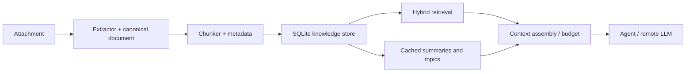

# EducAI Knowledge Architecture

Status: **DESIGNED / TECHNICALLY APPROVED FOR FUTURE IMPLEMENTATION** (bounded architecture pass; no implementation)

## 1. Context and problem

Conversations must be able to accept hundreds or thousands of TXT/Markdown documents while keeping durable knowledge local to the EducAI conversation. Remote models receive only the user request and a bounded, provenance-rich evidence package. Knowledge is owned by EducAI, not by a provider, an ephemeral OpenCode session, or a SaaS service.

## 2. Goals

- Local parsing, normalization, hashing, deduplication, chunking, embeddings, lexical/vector indexes, summaries, caches, and change tracking.
- Hybrid semantic + lexical retrieval with deterministic context budgeting.
- Incremental add/modify/delete and crash-safe restart/resume.
- Provenance suitable for UI citations and Creation generation.
- Cross-platform desktop packaging without a server or daemon.

## 3. Non-goals

This pass does not implement ingestion, PDF/DOCX/XLSX/OCR, a local generative model, UI, MCP, provider changes, or the HUMAN-PASS Creations flow. It does not reopen closed milestones and does not start M11.

## 4. Constraints and current integration boundary

The existing conversation, attachment, project-filesystem, OpenCode, and Creation contracts remain authoritative. Knowledge is a conversation/project-owned subsystem adjacent to attachments and outputs; attachments remain the source files and Creations continue through their existing flow. An adapter may later expose retrieval to an agent (native tool, local API/IPC, MCP, or another mechanism), but the domain API must not depend on MCP.

## 5. Overview



The public domain operations are `index_document`, `remove_document`, `search`, `assemble_context`, and `summarize_collection`; adapters translate attachments and agent requests into these operations.

## 6. Ingestion and canonical representation

An extractor registry maps media type to a parser. V1 has built-in TXT and Markdown parsers; future parsers (including a MarkItDown adapter) implement the same interface and are not architectural dependencies. A canonical document stores stable `document_id`, conversation/project id, source attachment id/path, content hash, byte size, media type, detected encoding, parser/version, created/modified times, and extraction warnings. Structured spans retain heading path, paragraph/list boundaries, transcript speaker and timestamp when present, and later page/sheet/range/section fields only when the parser actually knows them.

## 7. Chunking

Chunk by semantic boundaries: Markdown headings, paragraphs, list items, and transcript turns; then pack adjacent units to a configurable **target chunk size**. For the V1 `multilingual-e5-small` recommendation, target about 300–400 embedding-tokenizer tokens with a small boundary-aware overlap (about 10–15%). This target is not the maximum.

Every chunker must also enforce a **hard embedding input limit** derived from the active embedding generation/model contract. The limit is counted with that model's relevant tokenizer, not characters or whitespace-delimited words, and leaves any required margin for model-specific prefixes or formatting. A chunker may favor structural boundaries, but it must never emit an embedding input exceeding that hard limit. If a heading section, paragraph, list item, or speaker/timestamped turn is larger than the limit, split it deterministically into ordered sub-chunks while retaining the source document, structural parent, ordinal/position, and sub-chunk relationship in provenance. Thus V1 remains structure-aware rather than fixed-window chunking, with the model-aware limit as its upper constraint. Each chunk has a stable id derived from document hash, parser/chunker versions, ordinal, and normalized content hash. This permits parser-specific chunkers without changing retrieval contracts.

## 8. Embeddings

Recommended V1 model: **multilingual-e5-small** (or its maintained ONNX equivalent), CPU-friendly, multilingual Spanish/technical quality, approximately 384 dimensions and a modest disk/RAM footprint. Package the runtime behind an embedding-provider interface and benchmark it on representative Spanish technical/transcript queries. Alternatives: `bge-m3` (better multilingual coverage, substantially larger/slower) and `multilingual-e5-base` (quality gain, higher resources).

Each embedding generation has a versioned model contract containing at least: model identifier; immutable model version/revision; tokenizer and tokenizer version where applicable; embedding dimensionality; maximum effective input tokens; input formatting contract; and normalization behavior. The chunker consumes this contract to calculate its hard limit. For the E5 family, the V1 contract must format inputs as `query: <user query>` for queries and `passage: <document chunk>` for document embeddings. These prefixes are part of embedding-generation configuration, not ad-hoc call-site behavior. Record this complete contract in every index generation.

Default distribution is an optional, signed first-use model download into an application-managed writable data directory, with a small offline-capable bundled option considered for a later edition. Downloads require HTTPS, a pinned signed manifest, checksums, atomic rename, and versioned directories. The manifest pins model ID, immutable revision, tokenizer/runtime compatibility, dimension, license notice, every file length and SHA-256. A model upgrade creates a new index generation and migrates/re-embeds in the background; old generations remain readable until success. This avoids inflating AppImage/NSIS while preserving reproducibility and offline behavior after first use.

## 9. Embedded storage and indexes

Use one SQLite database per conversation/project under a private `knowledge/` directory, with WAL, foreign keys, transactional migrations and durable job state. Tables cover documents, spans, chunks, embeddings, lexical metadata, summaries, model/parser versions, failures and jobs. SQLite FTS5 handles lexical search (unicode-aware tokenization plus separately normalized exact identifier fields). FTS5 is an embedded full-text virtual table with ranking, phrase, prefix and proximity queries; see the [official SQLite FTS5 documentation](https://sqlite.org/fts5.html).

**V1 decision:** store fixed-dimension normalized vectors as BLOBs and search them in bounded, streaming Rust batches with exact cosine/dot-product scoring. This avoids an extra native extension/DLL while the target is tens of thousands of chunks; it must be benchmarked on representative Windows and Linux machines, not treated as a performance guarantee. `sqlite-vec` is a plausible V1.x adapter because it is dual Apache-2.0/MIT, pure C and cross-platform, but its own project states that it is pre-v1 and may make breaking changes. It is not a V1 dependency. [sqlite-vec project](https://github.com/asg017/sqlite-vec)

No PostgreSQL, Qdrant, Elasticsearch, Docker, or permanent service.

## 10. Hybrid retrieval and context assembly

Run lexical FTS and vector search in parallel. Merge ranked lists through reciprocal-rank fusion (RRF), rather than assuming BM25 and vector scores are directly comparable; boost exact normalized identifiers, source names, speakers and dates through explicit, testable rules. Deduplicate by content hash and diversify by source/document. Add a limited neighboring-chunk window only when it fits the budget. A future small multilingual local cross-encoder may rerank the already small merged set, but V1 does not add a second model/runtime.

Context assembly is provider-independent: intent/request → retrieval → ranking → token/character budget → evidence package containing excerpts and provenance. It enforces top-k, per-source caps, diversity, and a hard budget; it never forwards all attachments implicitly. The FTS query builder must escape/tokenize raw user text rather than interpolate FTS syntax.

## 11. Question answering vs corpus summarization

**Question answering:** user question → hybrid retrieval → ranked evidence → bounded context → remote LLM answer (with citations).

**Corpus summarization:** local extraction/chunking → cached per-document summaries or structured facts → topic/cluster summaries → hierarchical collection summary → optional remote synthesis of only intermediate summaries. Embeddings alone cannot produce faithful prose. V1 should use extractive/structured local aggregation and cache boundaries; a small local generative model is a later opt-in due to packaging and CPU cost. Remote synthesis is optional and auditable.

## 12. Incrementality, deduplication, and invalidation

Content hash identifies identical bytes; normalized-content hash detects renamed copies. Near-duplicate/embedded-transcript detection is deferred, with chunk-level hashes removing exact repeats. Add processes only new hashes. Modify invalidates extraction and descendants when content, parser version, schema, or chunker version changes. A change to any embedding-generation contract field—model, revision, tokenizer, input formatting, normalization, or dimensionality—creates a new vector generation and regenerates embeddings/vector index only; it does not require extraction or chunking when their content/configuration is unchanged. A chunker change regenerates chunks and their dependent FTS, embeddings/vector index, and summaries. Delete tombstones/removes document references and orphaned chunks transactionally. Jobs are resumable and keyed by document/version/chunker/model generation.

## 13. Provenance and privacy

Evidence carries source attachment, relative path/name, section/heading, speaker, timestamp, and future page/sheet/range fields when available, plus chunk id and character offsets. Local processing is the default privacy boundary. Only selected excerpts/intermediate summaries cross the provider boundary, and future UX should show indexed sources and what is being sent.

## 14. Background work and failure recovery

A bounded Rust worker pool performs extraction/indexing with cancellation, progress, partial readiness, and durable checkpoints. One bad document records a per-document error and does not poison the conversation. Handle odd encodings with loss-marked decoding, parser/model absence with actionable pending states, corruption with rebuild-from-source, disk-full with pause/resume, interruption with idempotent jobs, and incompatible schema/model with explicit migration or a new generation.

## 15. Performance expectations

For 100–1,000 text documents (tens of thousands of chunks), expect disk usage dominated by source text plus roughly `chunks × dimensions × 4` bytes for float32 vectors (about 1.5 KB per 384-d vector before indexes). Stream batches; do not load the full index into RAM. SQLite WAL and batched writes keep startup incremental; query latency should be dominated by bounded candidate scoring, with benchmarks required on representative hardware rather than guarantees.

## 16. Packaging implications

Linux AppImage remains portable: avoid glibc-sensitive services, ship/locate native runtime libraries beside the app, and validate against the controlled Ubuntu 24.04 / glibc ≤2.39 policy. Windows 11 x64 Tauri/NSIS needs no pre-gate product change: reserve a writable per-user model/cache directory, package any native DLLs beside the sidecar/app, and use the same signed manifest/checksum mechanism. Do not add a server or daemon. Confirm installer resource rules during the Windows runtime gate.

## 17. V1, V1.x, future

V1: TXT/Markdown, local extraction, structure-aware chunks, multilingual local embeddings, SQLite + FTS5 and portable vector interface, hybrid retrieval, provenance, incremental indexing, context assembly, and existing remote answer/Creation synthesis.

V1.x: PDF/DOCX/XLSX/PPTX/HTML adapters, better vector index/reranking, richer citations and collection/topic summaries.

Future: OCR, optional local generative summarization, advanced near-duplicate detection, distributed/large-corpus optimizations.

## 18. Alternatives and rejected approaches

Rejected sending the whole corpus, embeddings-only retrieval, provider-managed knowledge, mandatory MCP, MarkItDown-first design, and always-on database servers: each violates cost, exact-match, ownership, portability, or maintenance constraints. Qdrant/Elasticsearch/Postgres remain possible later only if measured scale disproves the embedded approach.

## 19. Open questions

- Final vector extension/license and benchmark threshold on Windows/Linux.
- Whether a signed bundled model is offered for offline-first editions.
- Exact context budgets and citation UX after retrieval telemetry.
- Whether local generative summarization meets resource and license requirements.

## 20. Implementation phases and validation

Implement only after the Windows native distribution/runtime gate. Then add domain/storage contracts, TXT/Markdown ingestion, indexing workers, hybrid retrieval/context assembly, and migration tests. Validate determinism, add/modify/delete/restart behavior, provenance, privacy logging, corruption recovery, 100/1,000-document benchmarks, offline operation, AppImage portability, and Windows NSIS/runtime packaging. Architecture status is **READY FOR REVIEW**; Windows remains the next runtime/distribution gate.

## 21. Concrete project boundary and durable layout

The present layout is authoritative: a Conversación is a `Project`, immutable
original Materials are in `inputs/`, agent scratch is `workspace/`, Creations
are `outputs/`, and only `publish/` can be shared. Knowledge is a private,
derived sibling and must never be provisioned to the OpenCode workspace merely
because it exists:

```text
<app-data>/projects/<project-id>/
  project.json                 # existing conversation/material/Creation aggregate
  inputs/                      # existing immutable source bytes
  workspace/                   # existing OpenCode scratch, not knowledge
  outputs/                     # existing Creations
  publish/                     # existing public snapshot only
  knowledge/                   # proposed private derived data
    knowledge.sqlite           # metadata, FTS5, vectors, summaries, jobs
    staging/                   # recoverable same-tree temporary work
    generations/               # optional staged model/schema rebuilds
```

Model artifacts are global, versioned app data (for example
`<app-data>/knowledge-models/<model-id>/<revision>/`), never AppImage/NSIS
mount data or project data. `knowledge/` is deleted with the project by the
existing fail-closed deletion path. It is not a publish, preview, Creation or
OpenCode XDG tree.

The existing `AgentEngine` and attachment authorization remain untouched. A
future application service resolves an authorized project/Material request to
`search_knowledge`, `assemble_context` or `summarize_collection`, then passes
an `EvidencePackage` through an adapter to the agent. Native tool, local IPC,
local API and MCP are possible adapters later; none define the domain.

## 22. Concrete canonical representation and schema responsibilities

An `Extractor` port consumes an authorized Material stream plus a known media
type and produces normalized UTF-8 canonical text and ordered spans. V1 has
built-in TXT/Markdown extractors. Future parsers—built-in, a MarkItDown adapter
or another library—implement this port and are not a V1 dependency.

The document record stores project/document/Material identity, safe source
name and relative path, original SHA-256, normalized-content SHA-256, byte size,
media type, detected encoding/warnings, source timestamps when available, and
extractor/canonical-schema version. A span carries only parser-known fields:
offsets, heading path, paragraph/list boundary, transcript speaker/timestamp,
and later page, sheet/range or Word section. Chunks reference spans and retain
text, offsets, ordinal, normalized hash and chunker version.

Logical SQLite responsibilities are:

| Data | Purpose |
| --- | --- |
| `schema_meta`, `model_generations` | schema and complete embedding-generation contract compatibility (model/revision, tokenizer, dimensions, effective input limit, formatting, normalization) |
| `documents`, `document_versions`, `spans`, `chunks` | source linkage, canonical text and provenance |
| `chunk_fts`, `chunk_terms` | FTS5/BM25 text and normalized exact IDs/dates/names |
| `embeddings` | generation, dimension, normalized BLOB and chunk reference |
| `jobs`, `job_items`, `failures` | resumable index work and scoped failures |
| `summaries`, `summary_inputs` | cached intermediate summaries and invalidation graph |

## 23. Incrementality and failure detail

Original SHA-256 deduplicates identical bytes. A normalized-content hash detects
renamed/copy-equivalent text. Multiple Material records can reference one
canonical document so user-visible provenance is retained. Chunk hashes remove
exact repeated transcript content. Near-duplicate detection and quoted-history
suppression are deliberately deferred: their false-positive cost requires real
corpus evidence.

| Change | Reuse | Recompute |
| --- | --- | --- |
| New unique Material | none | extraction → chunks → FTS → embeddings → affected summaries |
| Source content changes | no descendant data | that document's extraction descendants and parent summaries |
| Rename/metadata-only change | canonical text/chunks/vectors | source link/display provenance only |
| Parser/schema change | original bytes | extraction and descendants for affected format |
| Chunker change | canonical document | chunks, FTS, vectors and summaries |
| Embedding model, revision, tokenizer, formatting, normalization, or dimensionality change | documents/chunks/FTS | new vector generation only |
| Summary algorithm change | source/index data | affected summary cache only |
| Delete | other sources | transactional source unlink and orphan cleanup |

Jobs are idempotent by document version, parser, chunker and model generation.
Corrupt/unsupported inputs and odd encodings produce scoped failure records;
missing models produce a retryable pending state; disk-full pauses safely;
interrupted writes roll back or resume; derived-index corruption is rebuilt from
`inputs/` after preserving/quarantining the bad derived data. One bad document
cannot poison a conversation.

## 24. Cost and privacy model

The following work is local: file reads, parsing/extraction, normalization,
hashing, deduplication, chunking, metadata, tokenization, embedding, SQLite
FTS/vector search, RRF ranking, cache use, evidence selection and provenance.
An optional local reranker also stays local.

For a question, the remote LLM receives the user request plus only the bounded
Evidence Package. For a Creation it receives the request plus the same compact
evidence/provenance package through the current Creation flow. A prose summary
may require a remote generative synthesis, but it receives cached
per-document/topic intermediate summaries rather than the raw 1,000-document
corpus. Embeddings alone never claim to generate a faithful summary; V1 local
summarization is extractive/structured only. A local generative model is future
opt-in because its second runtime/model/CPU cost is not yet justified.

Future UX should disclose which documents are indexed, progress/failures, and
that selected excerpts—not all indexed files—will be sent remotely. Existing
metadata-only diagnostics constraints continue: raw sources, prompts, evidence
and embeddings do not enter logs.

## 25. Performance and packaging detail

At 384 float32 dimensions, each raw normalized vector is 1,536 bytes before
SQLite/index overhead; 30,000 vectors are about 44 MiB raw. Source text, FTS
and SQLite pages add variable disk consumption. The worker must batch and stream
to avoid full-index RAM loading; WAL and durable checkpoints make startup reuse
work rather than reindex it. Exact scoring at this scale is a benchmark-gated
baseline, not a latency promise. Measure indexing throughput, peak RAM, disk
growth and cold/warm query latency on representative Spanish technical and
transcript fixtures for 100 and 1,000 documents.

On Linux, no change to the controlled Ubuntu 24.04 / GLIBC <=2.39 AppImage or
host graphics boundary is proposed. A future ONNX Runtime must be packaged and
validated by the existing extracted-payload GLIBC gates, without Python, Docker,
GPU drivers or a daemon. Models are app-data downloads, not AppImage bytes.

On Windows, no change is required before the native Windows 11 x64 Tauri/NSIS
runtime gate. The current app-data root already supplies the future writable
model/cache location. When Knowledge is implemented, any ONNX Runtime DLL must
be explicitly packaged/tested by the NSIS build, and the same signed manifest
and checksum verification must apply to models. The current Windows artifact
must be validated unchanged; this pass adds no sidecar or native dependency.

## 26. Recommendation, alternatives and rejected approaches

V1 recommendation: TXT/Markdown built-in extraction; semantic-boundary chunks;
ONNX CPU `multilingual-e5-small` (pin exact export/revision after benchmark);
SQLite/WAL + FTS5; vector BLOB exact scoring; hybrid RRF; provenance;
incremental jobs; Context Assembly; and remote generation only for the bounded
answer/Creation/synthesis request. `multilingual-e5-base` is the quality
alternative if benchmarked gain justifies its resources. `bge-m3` is MIT and
multilingual but uses 1024 dimensions/8192 sequence length, so it is a heavier
future candidate, not an automatic default. [bge-m3 model card](https://huggingface.co/BAAI/bge-m3)

V1.x may add a measured ANN/vector extension, small local multilingual
reranking, PDF/DOCX/PPTX/XLSX/HTML extractors, richer citations and cached
hierarchical remote synthesis. Future work may consider OCR, local generative
summarization, advanced near-duplicate detection and an MCP adapter.

Rejected: sending all attachments/corpus each turn; embeddings-only search;
provider-managed knowledge; mandatory MCP; MarkItDown-first architecture;
Qdrant/PostgreSQL/Elasticsearch/Docker/always-on services; and default model
bundling. Each conflicts with local ownership, exact retrieval, footprint,
portability, privacy or maintenance priorities.

## 27. ADR assessment and open questions

No ADR is created now. The boundary is designed but exact model export,
benchmark threshold and vector implementation remain deliberately unpinned.
If V1 proceeds after the Windows gate, one ADR should record the actually
selected local-first store/hybrid retrieval boundary and its pinned runtime;
creating it now would falsely freeze untested dependencies.

The remaining evidence questions are narrowly scoped:

1. Which exact multilingual-e5-small ONNX export/revision meets license,
   Spanish technical retrieval and Windows/Linux package tests?
2. Does exact blocked scoring meet agreed p95 behavior at corpus scale, or does
   measured evidence justify a pinned embedded ANN extension?
3. What offline UX/package-size threshold merits a signed bundled-model option?
4. What coverage/citation language is understandable before remote hierarchical
   synthesis is enabled?

None blocks the current Windows runtime/distribution validation.

## 28. Validation criteria and status

Before implementation is complete, verify deterministic TXT/Markdown extraction
and chunk boundaries; authorized source linkage; add/modify/delete/restart and
version invalidation; hybrid exact/semantic retrieval; strict context budgets,
diversity and citations; no raw evidence in diagnostics; corruption/missing
model/disk-full/cancellation recovery; 100/1,000-document benchmarks; and
Windows/Linux packaging checks for each introduced native library. Run the
repository formatting, lint/type, relevant tests, integration checks and
`./scripts/verify` when implementation exists.

**Knowledge Architecture: DESIGNED / TECHNICALLY APPROVED FOR FUTURE
IMPLEMENTATION.** A fresh independent re-review returned APPROVE with no
remaining blockers (previous blocker status FIXED). It is not implemented and
not HUMAN ACCEPTED; implementation is intentionally deferred until after the
current Windows gate. M11 remains NOT STARTED. The next main gate is
**WINDOWS NATIVE DISTRIBUTION + REAL RUNTIME VALIDATION**; Linux human
validation remains pending as recorded by `CURRENT_CHECKPOINT.md`.
