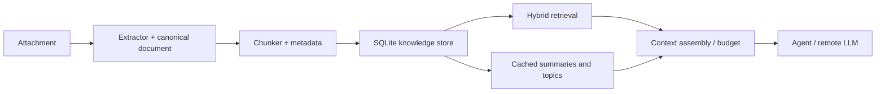

# EducAI Knowledge Architecture

Status: **IMPLEMENTED (K1–K6) — LINUX SEMANTIC RUNTIME HUMAN-PASS**; Windows Knowledge semantic runtime validation remains a separate future gate. Architecture design was approved in the bounded pass below; implementation, Linux runtime closure, and K6 hierarchical summarization closure are recorded in `CURRENT_CHECKPOINT.md`.

## 1. Context and problem

Conversations must be able to accept hundreds or thousands of TXT/Markdown documents while keeping durable knowledge local to the EducAI conversation. Remote models receive only the user request and a bounded, provenance-rich evidence package. Knowledge is owned by EducAI, not by a provider, an ephemeral OpenCode session, or a SaaS service.

## 2. Goals

- Local parsing, normalization, hashing, deduplication, chunking, embeddings, lexical/vector indexes, summaries, caches, and change tracking.
- Hybrid semantic + lexical retrieval with deterministic context budgeting.
- Incremental add/modify/delete and crash-safe restart/resume.
- Provenance suitable for UI citations and Creation generation.
- Cross-platform desktop packaging without a server or daemon.

## 3. Non-goals

This pass does not implement ingestion, PDF/DOCX/XLSX/OCR, a local generative model, UI, MCP, provider changes, or the HUMAN-PASS Creations flow. It does not reopen closed milestones and does not start M11.

## 4. Constraints and current integration boundary

The existing conversation, attachment, project-filesystem, OpenCode, and Creation contracts remain authoritative. Knowledge is a conversation/project-owned subsystem adjacent to attachments and outputs; attachments remain the source files and Creations continue through their existing flow. An adapter may later expose retrieval to an agent (native tool, local API/IPC, MCP, or another mechanism), but the domain API must not depend on MCP.

## 5. Overview



The public domain operations are `index_document`, `remove_document`, `search`, `assemble_context`, and `summarize_collection`; adapters translate attachments and agent requests into these operations.

## 6. Ingestion and canonical representation

An extractor registry maps media type to a parser. V1 has built-in TXT and Markdown parsers; future parsers (including a MarkItDown adapter) implement the same interface and are not architectural dependencies. A canonical document stores stable `document_id`, conversation/project id, source attachment id/path, content hash, byte size, media type, detected encoding, parser/version, created/modified times, and extraction warnings. Structured spans retain heading path, paragraph/list boundaries, transcript speaker and timestamp when present, and later page/sheet/range/section fields only when the parser actually knows them.

## 7. Chunking

Chunk by semantic boundaries: Markdown headings, paragraphs, list items, and transcript turns; then pack adjacent units to a configurable **target chunk size**. For the V1 `multilingual-e5-small` recommendation, target about 300–400 embedding-tokenizer tokens with a small boundary-aware overlap (about 10–15%). This target is not the maximum.

Every chunker must also enforce a **hard embedding input limit** derived from the active embedding generation/model contract. The limit is counted with that model's relevant tokenizer, not characters or whitespace-delimited words, and leaves any required margin for model-specific prefixes or formatting. A chunker may favor structural boundaries, but it must never emit an embedding input exceeding that hard limit. If a heading section, paragraph, list item, or speaker/timestamped turn is larger than the limit, split it deterministically into ordered sub-chunks while retaining the source document, structural parent, ordinal/position, and sub-chunk relationship in provenance. Thus V1 remains structure-aware rather than fixed-window chunking, with the model-aware limit as its upper constraint. Each chunk has a stable id derived from document hash, parser/chunker versions, ordinal, and normalized content hash. This permits parser-specific chunkers without changing retrieval contracts.

## 8. Embeddings

Recommended V1 model: **multilingual-e5-small**, CPU-friendly, multilingual Spanish/technical quality, and 384 dimensions. The immutable fp32 ONNX export, Rust tokenizer boundary, bundled ONNX Runtime CPU 1.22.0, first-use model download, artifact checksums, and platform loading/validation contract are accepted in [ADR-0016](../decisions/0016-knowledge-local-inference-runtime-distribution.md). Package the runtime behind an embedding-provider interface and benchmark it on representative Spanish technical/transcript queries. Alternatives: `bge-m3` (better multilingual coverage, substantially larger/slower) and `multilingual-e5-base` (quality gain, higher resources).

Each embedding generation has a versioned model contract containing at least: model identifier; immutable model version/revision; tokenizer and tokenizer version where applicable; embedding dimensionality; maximum effective input tokens; input formatting contract; and normalization behavior. The chunker consumes this contract to calculate its hard limit. For the E5 family, the V1 contract must format inputs as `query: <user query>` for queries and `passage: <document chunk>` for document embeddings. These prefixes are part of embedding-generation configuration, not ad-hoc call-site behavior. Record this complete contract in every index generation.

Default distribution is a bundled, checksum-pinned ONNX Runtime CPU payload plus an optional first-use model download into an application-managed writable data directory; see [ADR-0016](../decisions/0016-knowledge-local-inference-runtime-distribution.md). Downloads require HTTPS, a pinned manifest, checksums, atomic rename, and versioned directories. The manifest pins model ID, immutable revision, tokenizer/runtime compatibility, dimension, license notice, every file length and SHA-256. A model upgrade creates a new index generation and migrates/re-embeds in the background; old generations remain readable until success. This avoids inflating AppImage/NSIS with the model while preserving reproducibility and offline behavior after first use.

## 9. Embedded storage and indexes

Use one SQLite database per conversation/project under a private `knowledge/` directory, with WAL, foreign keys, transactional migrations and durable job state. Tables cover documents, spans, chunks, embeddings, lexical metadata, summaries, model/parser versions, failures and jobs. SQLite FTS5 handles lexical search (unicode-aware tokenization plus separately normalized exact identifier fields). FTS5 is an embedded full-text virtual table with ranking, phrase, prefix and proximity queries; see the [official SQLite FTS5 documentation](https://sqlite.org/fts5.html).

**V1 decision:** store fixed-dimension normalized vectors as BLOBs and search them in bounded, streaming Rust batches with exact cosine/dot-product scoring. This avoids an extra native extension/DLL while the target is tens of thousands of chunks; it must be benchmarked on representative Windows and Linux machines, not treated as a performance guarantee. `sqlite-vec` is a plausible V1.x adapter because it is dual Apache-2.0/MIT, pure C and cross-platform, but its own project states that it is pre-v1 and may make breaking changes. It is not a V1 dependency. [sqlite-vec project](https://github.com/asg017/sqlite-vec)

No PostgreSQL, Qdrant, Elasticsearch, Docker, or permanent service.

## 10. Hybrid retrieval and context assembly

Run lexical FTS and vector search in parallel. Merge ranked lists through reciprocal-rank fusion (RRF), rather than assuming BM25 and vector scores are directly comparable; boost exact normalized identifiers, source names, speakers and dates through explicit, testable rules. Deduplicate by content hash and diversify by source/document. Add a limited neighboring-chunk window only when it fits the budget. A future small multilingual local cross-encoder may rerank the already small merged set, but V1 does not add a second model/runtime.

### K3 implemented hybrid retrieval contract

K3 exposes one project-local `hybrid_search(query, optional_provider, options)` API. Its defaults return up to 10 candidates after bounded overfetch of 40 FTS5/BM25 and 40 active-generation exact-semantic candidates. Fusion is `sum(1 / (60 + rank))`; ties are resolved by best rank, lexical rank, semantic rank, document id, then chunk id. This deliberately does not calibrate BM25 against vector similarity.

Identifier-like tokens must contain letters and ASCII digits and may retain `-`, `_`, `:` or `/`; they are NFC-normalized and lowercased. An exact candidate occurrence receives the bounded post-RRF additive preference of 0.02, never replacing RRF. Natural-language-only queries receive no identifier boost. The fusion stage deduplicates a canonical chunk across both signals and alias sources, chooses a stable source representative, and applies conservative caps of three candidates per canonical document and three per source path.

K3 itself does not expand neighbors: direct retrieval results retain `neighbor_of: None`. K4 Context Assembly may add bounded same-document neighbors only after K3 selection, preserving the retrieval boundary. Missing local semantic capability returns lexical-only results with semantic availability marked unavailable; corrupt semantic data still follows K2's typed error/recovery path. Only ready vectors from the provider's active generation participate. There is no ANN, vector extension, reranker, persistent query state, or remote fallback. HYBRID RETRIEVAL REMOTE LLM CALLS: ZERO.

### K4 implemented context assembly contract

K4 consumes the already-bounded K3 `HybridSearchResult` list through `KnowledgeStore::assemble_context(query, candidates, options)`. The store first verifies each supplied chunk/document/source identity belongs to its active project, so a foreign project's candidates become no evidence. `ContextAssembler` performs no FTS or vector query; when enabled, the store supplies only immediate same-document ordinal neighbors for the selected K3 candidates. The result is a provider-independent structured `EvidencePackage`, not a prompt string and not an `AgentEngine` request.

`EvidencePackage` keeps query metadata separate from untrusted evidence text, the configured assembly options, ordered entries, and non-content totals. Each entry retains canonical document/chunk/source identity, source path/name, excerpt text, complete/trimmed status, adjusted provenance offsets/lines, heading and structural metadata, hybrid score/ranks, embedding generation, lexical/semantic/exact-ID/neighbor signals, and its estimated cost. It is therefore sufficient for future citation rendering without a database re-query. No evidence text, query text, or document contents are logged.

The hard budget applies to **evidence entries only**, not the user query. Its conservative local default is 3,000 units with a 300-unit reserve, leaving a usable evidence ceiling of 2,700 units for future system instructions, user input, framing, and answers. The default `BudgetEstimator` is deliberately not the E5 tokenizer: it estimates one unit per three UTF-8 bytes (rounded up) plus 24 fixed units per entry for source/provenance framing. This is a deterministic safety estimate, not a claim of exact remote-model tokenization. `estimated_budget_used <= estimated_budget_limit` is an invariant, including every emitted entry body and its fixed framing overhead.

Defaults also cap assembly at eight entries, two entries per document, two per source, 900 units per entry, and ten K3 candidates. A 64-unit minimum useful entry stops selection instead of emitting tiny fragments. Direct K3 candidates are selected in their deterministic fusion order first; canonical chunk/text duplicates and caps are defensively suppressed. Immediate neighbors have radius one by default, consume the same budget/caps, retain provenance, are marked `neighbor_of`, and are never considered until all direct candidates have had priority.

Oversize direct or neighbor chunks may become a `TruncatedExcerpt` only when a deterministic UTF-8-safe prefix can fit. Selection favors paragraph/sentence/list/whitespace boundaries; the entry is explicitly marked, and end offset/end line are narrowed to the included prefix rather than claiming the entire chunk. Empty K3 input returns a valid empty package. K3 lexical-only fallback and partial readiness remain valid inputs. Context Assembly has no schema change, persistence, reranker, summarizer, provider formatting, provider tokenizer, or remote fallback. CONTEXT ASSEMBLY REMOTE LLM CALLS: ZERO.

The FTS query builder must escape/tokenize raw user text rather than interpolate FTS syntax.

## 11. Question answering vs corpus summarization

**Question answering:** user question → per-turn `BoundRoute` (typed follow-up
and creation pre-gates, then the multilingual semantic classifier when the
intent is still open, then exclusive deterministic fallback, then the compact/K6
clamp) → one of the bounded engines below → remote LLM answer **or** a fully
local inventory/exhaustive-negative answer. The ES/EN keyword detectors
(`detect_retrieval_intent`, `detect_summary_intent`) are the **fallback and
execution helpers**, not a competing production classifier and not a general
multilingual parser. `CorpusExhaustive` requires a presence/absence cue, a concrete extracted presence term, and a global, inventory, or numeric corpus scope marker. Open-content questions asking for abstract topics/themes without corpus scope, and presence questions whose extracted terms are empty, remain `NormalSemantic` even when they include broad or numeric scope words, so an exhaustive scan can never run with an empty needle. Inspection metrics (`eligible_materials`, `materials_inspected`, `lexical_hits`, `semantic_hits`) describe retrieval activity and must not be copied into user-visible sources. The grounded source list (`TurnMetrics.source_names`, formerly the text-appended `Fuentes:` block) lists only selected K4 evidence that actually entered the final answer context: lexical supporting sources on the exhaustive path, retrieved evidence on the compact path, and contributing thematic evidence on the thematic path. Budget-dropped and semantic-only exhaustive candidates are never citations. The source list is persisted as structured per-turn provenance and surfaced in the per-turn detail popover, never concatenated into the visible assistant answer text. A corpus-wide negative answer is produced locally only when `exhaustive_coverage=complete` and extracted presence terms had zero lexical hits after inspecting the full eligible READY inventory; top-k emptiness and semantic near-misses are never treated as global absence, and they must not fabricate citations.

**Corpus summarization:** local extraction/chunking → cached per-document summaries or structured facts → topic/cluster summaries → hierarchical collection summary → optional remote synthesis of only intermediate summaries. Embeddings alone cannot produce faithful prose. V1 should use extractive/structured local aggregation and cache boundaries; a small local generative model is a later opt-in due to packaging and CPU cost. Remote synthesis is optional and auditable.

### Four semantic behaviors

- **Normal semantic retrieval:** ordinary K3/K4 top-k hybrid retrieval over a bounded handful of chunks/sources. Appropriate for ordinary question answering ("¿Qué explicó Delfina sobre pasado simple?", "¿Qué se acordó respecto del aumento del precio de las clases?").
- **Concrete corpus exhaustive presence/inventory:** a local exhaustive scan of every READY chunk with a real extracted search needle ("¿Qué reuniones mencionan presente continuo?", "¿Se habló en alguna de las 15 reuniones de Kubernetes u OpenShift?"). Supports locally produced negative answers only when coverage is complete and the needle had zero lexical hits.
- **Corpus-wide thematic synthesis:** "¿Cuáles son los temas principales que aparecen repetidamente en las 15 reuniones?", "¿Qué temas se repiten en todas las reuniones?", "Resumí los temas recurrentes en estos 15 archivos.", "What recurring themes appear across all meetings?". This is a third intent (`CorpusThematic`), recognized as a thematic content head ("temas", "acuerdos", "dificultades", "themes", "topics", ...) plus corpus-wide scope (global marker, numeric corpus unit, a corpus-wide scope phrase, or recurrence wording such as "recurrentes", "se repiten", "repetidamente", "recurring", "recur"). Recurrence is inherently corpus-wide, so an unscoped "¿Cuáles son los temas recurrentes?" or "What themes recur?" qualifies without an explicit scope phrase. It is neither ordinary top-k Q&A nor concrete presence search, and it never routes to the exhaustive presence scanner. "¿Cuáles son las 5 ideas principales?" (no corpus scope) and "¿Qué ocurrió el 15 de julio?" (a date) stay `NormalSemantic`.
- **Knowledge inventory:** a fourth intent (`KnowledgeInventory`) that is deliberately **not** a RAG retrieval mode. It is a local metadata command over the persisted KnowledgeStore ("listame los archivos", "cuántos documentos tengo", "¿tengo el archivo X?"), answered entirely from `knowledge.sqlite` with `remote_calls = 0`. It must never be used for content-presence questions (see §11b).

## 11b. Knowledge inventory — local metadata command (implemented)

`KnowledgeInventory` is a fourth `RetrievalIntent` classification but **not** a fourth `RetrievalMode`/RAG mode. It reuses the existing local-answer short-circuit in the send flow and never touches semantic retrieval, lexical evidence, query embeddings, context budgets, top-K, provider synthesis, or the OpenCode agent.

### Boundaries

| Question | Intent | Why |
|---|---|---|
| "listame todos los archivos", "cuántos documentos tengo" | KnowledgeInventory | inventory action over the persisted store |
| "¿tengo el archivo X?", "¿está cargado X?" | KnowledgeInventory | deterministic metadata membership lookup |
| "qué archivos hablan de presente continuo?", "¿Qué archivos contienen Kubernetes?" | CorpusExhaustive | content-presence needle (never inventory) |
| "qué se decidió sobre Google Workspace?" | NormalSemantic | ordinary open question |
| "resumime todos los archivos" | K6 summary | summary verb gate precedes inventory |
| "cuáles son los temas recurrentes?" | CorpusThematic | thematic content head + corpus scope |
| "cuánto mide el archivo X?" | NormalSemantic | measure query, never inventory |

Classification priority is `CorpusThematic` → K6 summary gate → `KnowledgeInventory` → `CorpusExhaustive`/presence → `NormalSemantic`. The inventory detector is rule-based and deterministic; it **vetoes** any phrasing that carries a presence cue ("hablan de", "mencionan", "contain", "contiene", ...) or a measure cue ("mide", "pesa", ...). Corpus nouns alone ("archivo", "documento", "file", ...) are never sufficient — an inventory action (list verb, count cue, possession/location phrasing, recent/added wording, or a membership phrase) must also be present.

### Local read path

- `KnowledgeStore::inventory_snapshot(state, sort)` reads `material_sources` JOIN `material_index_state` JOIN `documents` and returns `KnowledgeMaterialRecord { material_id, source_name, media_type, state, indexed_at }`. **No filesystem scan and no agent workspace is ever consulted.**
- `inventory_count(state)` returns the exact persisted count for a state filter.
- `find_material_by_source_name(needle, state)` performs deterministic equality matching only: normalized basename first, then exact case-insensitive `source_name`. Outcomes: exact match, not found, or ambiguous multiple normalized matches. No fuzzy/semantic matching.
- Default status semantics are READY: a plain "listame los archivos" lists only READY materials and "cuántos documentos tengo" counts READY exactly. Explicit "incluí también los que fallaron"-style phrasings may widen the filter to the existing status vocabulary (`pending`/`ready`/`failed`/`unsupported`).
- Sorting is deterministic and local. Chronological requests ("en orden cronológico", "chronologically") use the import/index timestamp (`documents.indexed_at`, with a documented fallback to `material_sources.updated_at`); "últimos"/"latest"/"recientes" request newest-first; "alfabético"/"alphabetical" and the default order are alphabetical by name. Filename dates are never parsed.

### App path and contract

`prepare_knowledge_context` routes a `KnowledgeInventory` turn to `prepare_inventory_knowledge_context`, which queries the store metadata, builds a `local_answer`, and returns an `AgentKnowledgeContext` with `entries = []`, `citation_source_names = []`, and `retrieval_mode = None`. `send_message_run`'s existing local-answer short-circuit then completes the turn locally: no OpenCode agent session, no `run_agent_with_inputs`, no provider tokens, no query embedding, no evidence assembly.

For pure inventory queries the observable contract is:

- `remote_calls = 0`, provider invoked `false`, query embedding generated `false`;
- `retrieval_mode` is not `hybrid`/`normal`/`exhaustive`/`thematic` — it stays `None`, and the truthful local reason is surfaced as `local_mode = "inventory"` in the durable turn metrics and as `reason=inventory` in the usage log;
- the log emits `[knowledge] local_mode=inventory inventory_action=list|count|membership materials_ready=N remote_calls=0` (no sensitive paths, no document content);
- no semantic `Fuentes:` block is appended — the list itself is the answer, and count/membership are plain local prose;
- **no top-K truncation**: listing returns all matching READY materials regardless of count.

### Deduplication, sorting, and restart semantics

Knowledge is content-addressed: byte-identical files share a canonical document but each persisted material keeps its own canonical `source_name`. Inventory lists/counts persisted unique materials and never fabricates aliases. If only the canonical first `source_name` is persisted, only that name is shown. Chronological ordering uses `documents.indexed_at`, never filename parsing. Restart persistence is exact: inventory list, count, and membership read the same persisted rows after close/reopen with no reindex, no embedding generation, and no provider call.

### Current-turn vs persisted Knowledge

A later turn may report `0 archivos procesados` because no new files were attached in that turn. That must never imply the Knowledge store is empty: inventory queries read persisted `knowledge.sqlite` state and are never derived from `accepted_import_operation.total` or any current-turn attachment/import accounting.

## 11a. Corpus-wide thematic synthesis (implemented)

`KnowledgeStore::thematic_synthesis_evidence` performs the whole aggregation locally and hands the caller a bounded, deterministic evidence set; the app then runs **one** bounded remote synthesis call over that evidence.

Pipeline: READY documents → local tokenization over one **shared bounded per-document window** (at most 64 inspected chunks, used for both candidate discovery and evidence localization, so a theme that can be evidenced is always discoverable first) → per-document candidate-term presence over **distinct documents** (a term must appear in at least two distinct documents to become a candidate; duplicated chunks inside one document never inflate document frequency; already-`Ready` per-document K6 summaries join the document representation to broaden candidates but are never sent as evidence) → candidate terms are **content-anchored**: standalone candidates are content words only (structural minimum-length rule, plus a bounded categorized closed-class function/discourse list and a bounded meeting-process scaffolding list), so "es", "no", "al", "lo", "etc." never become recurring "themes" → multi-word concepts are **first-class**: contiguous two-word phrases and function-word-bridged phrases such as "presente continuo", "Google Workspace", "comprensión auditiva", or "preguntas en pasado" compete directly with unigrams (a phrase with equal support outranks a unigram) → deterministic theme ranking by distinct-document support (then phrase preference on ties, bounded occurrence strength, a mild demotion for corpus-saturated standalone unigrams, lexical specificity, and term order) with **constituent-redundancy removal** (a unigram that is a token of a recurring phrase with at least as much support is dropped, since the phrase is the more informative concept) → **explicit candidate-theme cap (at most 20) before any evidence is constructed** → theme-local evidence selection (for each selected theme, the strongest chunk from each of its distinct supporting documents, windowed around that specific theme, matched token/phrase-boundary aware so a short term can never match inside an unrelated larger word) → **interleaved, source-diverse bounded candidate list that guarantees every selected theme contributes at least one theme-local excerpt**, preferring unused then least-used supporting documents → one remote synthesis with locally appended `Fuentes`.

**Ranking contract:** what makes a candidate stronger is, first and foremost, **distinct-document support** (a term present in more distinct meetings is stronger), transformed by two structural corrections that keep conversational boilerplate from crowding out meaningful topics:

- **Phrase specificity.** A multi-word concept carries more discriminating information per supporting document than a single generic word, so a phrase's distinct-document support is scaled up (`THEMATIC_PHRASE_SPECIFICITY`) when ranked against unigrams. This is why a generic chatter unigram present in 15/15 documents does not automatically beat a meaningful phrase present in only 7–10/15 documents.
- **Strong saturation penalty.** A standalone unigram present in at least 80% of the eligible documents is treated as corpus-wide conversational background, not as a discriminating theme. Every document beyond that saturation floor receives a per-document penalty (`THEMATIC_SATURATION_PENALTY_PER_DOC`) on its support, strong enough that a near-ubiquitous generic word is discounted below a meaningful phrase in far fewer documents. Phrases never receive this penalty.

On ties a **phrase** is preferred over a unigram; then bounded **occurrence strength** (number of distinct chunk texts containing the term, deduplicated per document) breaks ties; then **lexical specificity** (longer terms) and finally canonical term order. A unigram that is a **token of a recurring phrase with at least as much distinct-document support** (compared on raw distinct-document frequency, never on the scaled score) is removed as constituent redundancy, because the phrase is the more informative concept ("preguntas" is redundant beside "preguntas en pasado"). The final candidate set is **explicitly capped at 20 themes**, selected before any evidence is constructed.

Content anchoring is a bounded, categorized lexical classification, not an unbounded stopword list: standalone candidates must be content words. The closed-class function/discourse list also covers common discourse and politeness fillers such as "bueno", "claro", "gracias", "verdad"; the meeting-process scaffolding list also covers meeting-participant role nouns such as "alumnos" and "docente". Those categories never become standalone recurring themes but may still appear inside a phrase headed by a real content word. The structural ranking above is the primary defense against open-class conversational noise; the bounded categorized lists are a secondary guard, never the mechanism by which the ranking grows.

Theme-local evidence: evidence for a theme is never "the first chunk containing any candidate token". For each selected theme the distinct supporting documents are identified and their strongest supporting chunks are chosen; the excerpt is windowed around that specific theme, so a theme that appears only in a late section of a document (for example a substantial "past continuous" discussion buried after unrelated opening material) is still discovered and evidenced with the actual supporting text. The evidence window offsets are snapped to UTF-8 character boundaries, so the slice can never split a multi-byte Unicode scalar value (accented Spanish such as "comprensión auditiva" never panics). Supporting documents are ordered by theme strength (distinct-chunk support) then canonical document id — a content hash, never a filename — so early lexicographic sources cannot monopolize the budget and late sources such as `doc17`/`doc48` contribute on equal footing.

Source provenance: only documents whose excerpts actually entered the final evidence package appear in the grounded source list (`TurnMetrics.source_names`, surfaced in the per-turn detail popover; it was formerly the text-appended `Fuentes:` block). Every selected theme is guaranteed at least one theme-local excerpt in the bounded candidate list; the list prefers distinct source documents before reusing one, so a single document cannot monopolize the budget, and if one document supports several themes its filename is deduplicated in the user-visible source list. A high-salience theme present in exactly one document never becomes a recurring-theme candidate, so its source is neither forwarded as evidence nor cited. Documents that were inspected and even candidate-producing but dropped by the bounded budget are never cited. Semantic similarity alone is never source provenance.

K6 role: persisted `Ready` per-document K6 summaries are read and reused to **broaden candidate themes** only; they are never synthesized on demand, so a thematic question never causes one remote call per document. Final evidence is always windowed around the theme inside persisted source chunks, so K6 summary text is never sent as evidence by itself; summary sentences are not forwarded.

Coverage semantics: CorpusThematic is thematic synthesis over selected evidence, not deterministic absence checking. The serialized request never emits exhaustive-negative instructions ("Do not claim that a topic is absent…"); that text belongs only to the exhaustive route. A theme absent from the bounded thematic evidence is explicitly not treated as proof it never appeared. Candidate discovery and evidence localization inspect only the first **64 chunks per document** (a shared bounded window); a theme that appears only after chunk 64 is neither discovered nor evidenced, so CorpusThematic explicitly does **not** claim full-document thematic coverage beyond that bound.

Cost model: large local work (O(N) chunk scanning, document-frequency aggregation) is acceptable; the remote context is a fixed budget (default 8,000 local units, at most 20 entries, at most 20 candidate themes) regardless of corpus size, so 15, 50, or 100 documents produce substantially smaller context than the raw corpus. Exactly zero remote calls are made per document: Ready summaries are reused but never regenerated, no embeddings are queried, and no summary is synthesized on demand. `retrieval_mode` is `thematic` (Conversation Details distinguishes it from `normal` and `exhaustive`); the semantic provider is reported as `not_requested`.

Restart/cache behavior: the aggregation is recomputed deterministically from persisted chunks each turn; already-`Ready` per-document summaries are durable in SQLite and reused across restarts (a later turn never regenerates them). A corpus with fewer than two READY documents cannot exhibit recurring themes across distinct meetings, so the thematic intent falls back to the compact K3/K4 semantic path (reported as `normal`).

## 12. Incrementality, deduplication, and invalidation

Content hash identifies identical bytes; normalized-content hash detects renamed copies. Near-duplicate/embedded-transcript detection is deferred, with chunk-level hashes removing exact repeats. Add processes only new hashes. Modify invalidates extraction and descendants when content, parser version, schema, or chunker version changes. A change to any embedding-generation contract field—model, revision, tokenizer, input formatting, normalization, or dimensionality—creates a new vector generation and regenerates embeddings/vector index only; it does not require extraction or chunking when their content/configuration is unchanged. A chunker change regenerates chunks and their dependent FTS, embeddings/vector index, and summaries. Delete tombstones/removes document references and orphaned chunks transactionally. Jobs are resumable and keyed by document/version/chunker/model generation.

## 13. Provenance and privacy

Evidence carries source attachment, relative path/name, section/heading, speaker, timestamp, and future page/sheet/range fields when available, plus chunk id and character offsets. Local processing is the default privacy boundary. Only selected excerpts/intermediate summaries cross the provider boundary, and future UX should show indexed sources and what is being sent.

## 14. Accepted-turn processing and failure recovery

Knowledge does not autonomously process arbitrary background work. Pre-send
selection is non-durable UI state only: it creates no Material, project copy,
Knowledge database row, embedding, history entry, remote provider call, or
operation.

An explicitly accepted turn containing Materials may own one durable,
project-local import/index operation (ADR-0017). Its ledger is committed before
the first project-owned copy and records `accepted`, `copying`,
`indexing_lexical`, `indexing_embeddings`, `pending_retry`, or `completed` plus
truthful counters. SQLite and filesystem are deliberately separate durable
boundaries; no false cross-store atomicity is claimed. The user turn is persisted
before the operation ledger exposes `prepared > 0`, so `prepared > 0` always
implies a durable, linked `turn_id` (the first `copied > 0` write carries the
turn link). Materials retain their own durable Pending/Ready/Failed/Unsupported
Knowledge state.

On restart an incomplete operation is discoverable and stays recoverable
`pending_retry` until explicit retry; reopening never starts an always-running
worker or silently changes it to Ready. One bad document records a sanitized
per-Material error and does not poison independent work. Post-acceptance
cancellation is not supported because filesystem, Material, and derived state
cannot yet be rolled back atomically.

The embedding phase advances the durable ledger at a bounded cadence
(approximately once per second, never per embedding) so the existing
`ProjectView.acceptedImport` polling path observes incremental progress:
`chunks_total`, `embeddings_total`, `embedding_completed`,
`embeddings_created`, `embeddings_reused`, and a stable phase start used only
to derive an average throughput. These are structural counters; no content,
vector, prompt, or raw path is exposed. Progress never marks an operation or
Material `Ready`/`completed` before the required indexing and embedding work
has actually finished.

Counter units are strict and never mixed. Material progress
(`total`, `copied`, `lexical_completed`, `failed`) counts Materials; embedding
progress (`chunks_total`, `embeddings_total`, `embedding_completed`,
`embeddings_created`, `embeddings_reused`) counts chunks/vectors. The accepted
import boundary preserves the chunk-level values produced by the embedding
pass and never overwrites `embedding_completed` with a Material count, so the
invariant `0 <= embedding_completed <= embeddings_total` holds and a polled
run never moves backwards (e.g. from 31778/31778 to 50/31778). Terminal
semantic eligibility is the chunk-unit condition "every chunk reachable from
the operation has an embedding": `embeddings_created + embeddings_reused ==
chunks_total` once the embedding phase resolves totals.

## 14a. Internal lexical Ready vs. user-facing materialsReady

Two distinct "ready" notions must never be conflated:

- **Internal lexical `MaterialIndexState::Ready`** is durable operational state
  for one Material's *derived-indexing stage*: extraction/normalization and
  chunking completed (or the document was reused). It says nothing about whether
  the Material is searchable or usable as Knowledge with embeddings. It is never
  surfaced directly to the user and is **not** the user-facing ready counter.

- **User-facing accepted-import `materialsReady`** is the count of accepted
  operation materials that are *fully usable for the currently active Knowledge
  embedding generation*. A material counts ready when (1) its lexical/indexing
  stage is complete (the internal `Ready` state) **and** (2) every chunk
  reachable from its document has a `ready` embedding for the active generation.
  A zero-chunk material counts ready once its lexical stage completes (the
  chunk predicate is vacuously satisfied). Embeddings from a previous/other
  generation never satisfy (2), so stale-generation vectors can never inflate
  the count. Lexical `Ready` alone never increments `materialsReady`; the UI
  therefore never shows N/N before every accepted material is actually usable.

The count is computed by `KnowledgeStore::accepted_import_materials_ready(
operation_id, generation_id)` — a read-only, indexed NOT EXISTS aggregate over
`accepted_import_materials`, `material_index_state`, `material_sources`,
`chunks`, and `chunk_embeddings` that never mutates Knowledge, regenerates
embeddings, or calls a provider. The caller resolves the active generation from
the embedded model manifest (a pure JSON parse; ONNX is never loaded to render
progress). The operation durably records the generation the embedding-progress
path used in the optional `embedding_generation_id` ledger column (additive
migration only; older operations keep it NULL and remain safe).

### Compact embedding progress

While an accepted import is non-terminal and `embeddings_total > 0`, the compact
UI derives `round(100 * embedding_completed / embeddings_total)` from the
durable ledger, bounded to `0..=99`. It therefore can say, for example,
`Procesando tu solicitud · 27% · 0 de 50 archivos listos` without calling a
provider or implying that any file is ready. The detailed popover retains the
exact counters. On reopen the same percentage is recomputed from the durable
counters; there is no separate progress state. Terminal copy is the concise
file-ready count, and the percentage is never used to claim `100%` early.

Degraded rule: when an operation has no resolved embedding context (no
embedding phase ever resolved chunks — no provider or nothing to embed), the
caller passes `generation_id = None` and lexically-ready materials count, which
is consistent with the previous `semanticReady` fallback (`failed === 0` when
`chunks_total == 0`) so an offline/lexical-only import is never stuck at 0/N.
Lexical and semantic units are never mixed in a single call; a failure is
represented truthfully (a failed Material is excluded from `materialsReady` and
surfaces through the `failed` counter).

## 15. Performance expectations

Measured on the production ingestion path, the dominant cost is local CPU
embedding inference, not SQLite (lexical index + SQLite was ~0.2% of a
controlled benchmark; embeddings were ~99.8%). The ONNX session therefore uses
a bounded intra-op thread count, `min(available_parallelism, 4)`, and the
application embedding batch size is 32 (the store clamps to its own safety
bound and the provider re-batches internally at a bounded cap of 32). Both are
throughput knobs only: model identity, revision, dimensions, tokenizer, mean
pooling, L2 normalization, prefixes, chunk identity, retrieval semantics, and
the persistence contract are unchanged. On the measured machine the bounded
configuration improved embedding throughput by roughly 3.5× over the
`threads=1, batch=8` baseline; this is a measured probe, not an SLA. A local
probe lives at `crates/project-knowledge/examples/embedding_throughput.rs`.

For 100–1,000 text documents (tens of thousands of chunks), expect disk usage dominated by source text plus roughly `chunks × dimensions × 4` bytes for float32 vectors (about 1.5 KB per 384-d vector before indexes). Stream batches; do not load the full index into RAM. SQLite WAL and batched writes keep startup incremental; query latency should be dominated by bounded candidate scoring, with benchmarks required on representative hardware rather than guarantees.

## 16. Packaging implications

Linux AppImage remains portable: avoid glibc-sensitive services, ship/locate native runtime libraries beside the app, and validate against the controlled Ubuntu 24.04 / glibc ≤2.39 policy. Windows 11 x64 Tauri/NSIS needs no pre-gate product change: reserve a writable per-user model/cache directory, package any native DLLs beside the sidecar/app, and use the same signed manifest/checksum mechanism. Do not add a server or daemon. Confirm installer resource rules during the Windows runtime gate.

## 17. V1, V1.x, future

V1: TXT/Markdown, local extraction, structure-aware chunks, multilingual local embeddings, SQLite + FTS5 and portable vector interface, hybrid retrieval, provenance, incremental indexing, context assembly, and existing remote answer/Creation synthesis.

V1.x: PDF/DOCX/XLSX/PPTX/HTML adapters, better vector index/reranking, richer citations and collection/topic summaries.

Future: OCR, optional local generative summarization, advanced near-duplicate detection, distributed/large-corpus optimizations.

## 18. Alternatives and rejected approaches

Rejected sending the whole corpus, embeddings-only retrieval, provider-managed knowledge, mandatory MCP, MarkItDown-first design, and always-on database servers: each violates cost, exact-match, ownership, portability, or maintenance constraints. Qdrant/Elasticsearch/Postgres remain possible later only if measured scale disproves the embedded approach.

## 19. Open questions

- Final vector extension/license and benchmark threshold on Windows/Linux.
- Whether a signed bundled model is offered for offline-first editions.
- Exact context budgets and citation UX after retrieval telemetry.
- Whether local generative summarization meets resource and license requirements.

## 20. Implementation phases and validation

The accepted-turn lifecycle is implemented before the Windows runtime gate;
Windows Knowledge validation itself remains unchanged. Validate determinism,
add/modify/delete/restart behavior, provenance, privacy logging, corruption
recovery, 100/1,000-document benchmarks, offline operation, AppImage
portability, and Windows NSIS/runtime packaging at their respective gates.

## 21. Concrete project boundary and durable layout

The present layout is authoritative: a Conversación is a `Project`, immutable
original Materials are in `inputs/`, agent scratch is `workspace/`, Creations
are `outputs/`, and only `publish/` can be shared. Knowledge is a private,
derived sibling and must never be provisioned to the OpenCode workspace merely
because it exists:

```text
<app-data>/projects/<project-id>/
  project.json                 # existing conversation/material/Creation aggregate
  inputs/                      # existing immutable source bytes
  workspace/                   # existing OpenCode scratch, not knowledge
  outputs/                     # existing Creations
  publish/                     # existing public snapshot only
  knowledge/                   # proposed private derived data
    knowledge.sqlite           # metadata, FTS5, vectors, summaries, jobs
    staging/                   # recoverable same-tree temporary work
    generations/               # optional staged model/schema rebuilds
```

Model artifacts are global, versioned app data (for example
`<app-data>/knowledge-models/<model-id>/<revision>/`), never AppImage/NSIS
mount data or project data. `knowledge/` is deleted with the project by the
existing fail-closed deletion path. It is not a publish, preview, Creation or
OpenCode XDG tree.

The existing `AgentEngine` and attachment authorization remain untouched. A
future application service resolves an authorized project/Material request to
`search_knowledge`, `assemble_context` or `summarize_collection`, then passes
an `EvidencePackage` through an adapter to the agent. Native tool, local IPC,
local API and MCP are possible adapters later; none define the domain.

## 22. Concrete canonical representation and schema responsibilities

An `Extractor` port consumes an authorized Material stream plus a known media
type and produces normalized UTF-8 canonical text and ordered spans. V1 has
built-in TXT/Markdown extractors. Future parsers—built-in, a MarkItDown adapter
or another library—implement this port and are not a V1 dependency.

The document record stores project/document/Material identity, safe source
name and relative path, original SHA-256, normalized-content SHA-256, byte size,
media type, detected encoding/warnings, source timestamps when available, and
extractor/canonical-schema version. A span carries only parser-known fields:
offsets, heading path, paragraph/list boundary, transcript speaker/timestamp,
and later page, sheet/range or Word section. Chunks reference spans and retain
text, offsets, ordinal, normalized hash and chunker version.

Logical SQLite responsibilities are:

| Data | Purpose |
| --- | --- |
| `schema_meta`, `model_generations` | schema and complete embedding-generation contract compatibility (model/revision, tokenizer, dimensions, effective input limit, formatting, normalization) |
| `documents`, `document_versions`, `spans`, `chunks` | source linkage, canonical text and provenance |
| `chunk_fts`, `chunk_terms` | FTS5/BM25 text and normalized exact IDs/dates/names |
| `embeddings` | generation, dimension, normalized BLOB and chunk reference |
| `jobs`, `job_items`, `failures` | resumable index work and scoped failures |
| `summaries`, `summary_inputs` | cached intermediate summaries and invalidation graph |

## 23. Incrementality and failure detail

Original SHA-256 deduplicates identical bytes. A normalized-content hash detects
renamed/copy-equivalent text. Multiple Material records can reference one
canonical document so user-visible provenance is retained. Chunk hashes remove
exact repeated transcript content. Near-duplicate detection and quoted-history
suppression are deliberately deferred: their false-positive cost requires real
corpus evidence.

| Change | Reuse | Recompute |
| --- | --- | --- |
| New unique Material | none | extraction → chunks → FTS → embeddings → affected summaries |
| Source content changes | no descendant data | that document's extraction descendants and parent summaries |
| Rename/metadata-only change | canonical text/chunks/vectors | source link/display provenance only |
| Parser/schema change | original bytes | extraction and descendants for affected format |
| Chunker change | canonical document | chunks, FTS, vectors and summaries |
| Embedding model, revision, tokenizer, formatting, normalization, or dimensionality change | documents/chunks/FTS | new vector generation only |
| Summary algorithm change | source/index data | affected summary cache only |
| Delete | other sources | transactional source unlink and orphan cleanup |

Jobs are idempotent by document version, parser, chunker and model generation.
Corrupt/unsupported inputs and odd encodings produce scoped failure records;
missing models produce a retryable pending state; disk-full pauses safely;
interrupted writes roll back or resume; derived-index corruption is rebuilt from
`inputs/` after preserving/quarantining the bad derived data. One bad document
cannot poison a conversation.

## 24. Cost and privacy model

The following work is local: file reads, parsing/extraction, normalization,
hashing, deduplication, chunking, metadata, tokenization, embedding, SQLite
FTS/vector search, RRF ranking, cache use, evidence selection and provenance.
An optional local reranker also stays local.

For a question, the remote LLM receives the user request plus only the bounded
Evidence Package. For a Creation it receives the request plus the same compact
evidence/provenance package through the current Creation flow. A prose summary
may require a remote generative synthesis, but it receives cached
per-document/topic intermediate summaries rather than the raw 1,000-document
corpus. Embeddings alone never claim to generate a faithful summary; V1 local
summarization is extractive/structured only. A local generative model is future
opt-in because its second runtime/model/CPU cost is not yet justified.

Future UX should disclose which documents are indexed, progress/failures, and
that selected excerpts—not all indexed files—will be sent remotely. Existing
metadata-only diagnostics constraints continue: raw sources, prompts, evidence
and embeddings do not enter logs.

## 25. Performance and packaging detail

At 384 float32 dimensions, each raw normalized vector is 1,536 bytes before
SQLite/index overhead; 30,000 vectors are about 44 MiB raw. Source text, FTS
and SQLite pages add variable disk consumption. The worker must batch and stream
to avoid full-index RAM loading; WAL and durable checkpoints make startup reuse
work rather than reindex it. Exact scoring at this scale is a benchmark-gated
baseline, not a latency promise. Measure indexing throughput, peak RAM, disk
growth and cold/warm query latency on representative Spanish technical and
transcript fixtures for 100 and 1,000 documents.

On Linux, no change to the controlled Ubuntu 24.04 / GLIBC <=2.39 AppImage or
host graphics boundary is proposed. The future bundled ONNX Runtime CPU payload
must be packaged and validated by the existing extracted-payload GLIBC gates,
without Python, Docker, GPU drivers or a daemon; the exact contract is
[ADR-0016](../decisions/0016-knowledge-local-inference-runtime-distribution.md).
Models are app-data downloads, not AppImage bytes.

K2 now implements this Linux payload: the final extracted AppImage contains the
approved ONNX Runtime CPU files under `usr/lib/educai/onnxruntime/`, passed the
GLIBC <=2.39 gate (core 2.27, provider 2.2), and was used for real local E5
inference. The production K5 semantic flow (TXT/Markdown ingestion → K1 lexical
→ K2 E5 embeddings → K3 hybrid → K4 bounded evidence → K5 deterministic request)
was closed as **HUMAN-PASS on Linux** (see `CURRENT_CHECKPOINT.md`): real E5
queries on Fedora with the real bundled ONNX Runtime resolved from the packaged
path, exact `INC-12345` preference intact, lexical fallback proven, and the
verified model cache at the production app-data root. Windows Knowledge runtime
validation remains a separate future gate.

On Windows, the current app-data root supplies the future writable model/cache
location. When Knowledge is implemented, the DLL payload specified in
[ADR-0016](../decisions/0016-knowledge-local-inference-runtime-distribution.md)
must be explicitly packaged/tested by the NSIS build, and its manifest/checksum
verification applies to models. The current Windows artifact remains validated
unchanged; its HUMAN-PASS does not validate the future Knowledge runtime.

## 26. Recommendation, alternatives and rejected approaches

V1 recommendation: TXT/Markdown built-in extraction; semantic-boundary chunks;
ONNX CPU `multilingual-e5-small` (pin exact export/revision after benchmark);
SQLite/WAL + FTS5; vector BLOB exact scoring; hybrid RRF; provenance;
incremental jobs; Context Assembly; and remote generation only for the bounded
answer/Creation/synthesis request. `multilingual-e5-base` is the quality
alternative if benchmarked gain justifies its resources. `bge-m3` is MIT and
multilingual but uses 1024 dimensions/8192 sequence length, so it is a heavier
future candidate, not an automatic default. [bge-m3 model card](https://huggingface.co/BAAI/bge-m3)

V1.x may add a measured ANN/vector extension, small local multilingual
reranking, PDF/DOCX/PPTX/XLSX/HTML extractors, richer citations and cached
hierarchical remote synthesis. Future work may consider OCR, local generative
summarization, advanced near-duplicate detection and an MCP adapter.

Rejected: sending all attachments/corpus each turn; embeddings-only search;
provider-managed knowledge; mandatory MCP; MarkItDown-first architecture;
Qdrant/PostgreSQL/Elasticsearch/Docker/always-on services; and default model
bundling. Each conflicts with local ownership, exact retrieval, footprint,
portability, privacy or maintenance priorities.

## 27. ADR assessment and open questions

[ADR-0016](../decisions/0016-knowledge-local-inference-runtime-distribution.md)
records the exact multilingual-e5-small ONNX export/revision and local runtime
distribution contract. It does not replace required benchmark and package
validation evidence.

The remaining evidence questions are narrowly scoped:

1. Benchmark threshold for semantic quality, throughput, peak RAM, and disk on
   representative Windows/Linux machines.
2. Does exact blocked scoring meet agreed p95 behavior at corpus scale, or does
   measured evidence justify a pinned embedded ANN extension?
3. What offline UX/package-size threshold merits a checksum-pinned bundled-model option?
4. What coverage/citation language is understandable before remote hierarchical
   synthesis is enabled?

None blocks the current Windows runtime/distribution validation.

## 28. Validation criteria and status

Production Material → Knowledge wiring is COMPLETE (`CURRENT_CHECKPOINT.md`):
every Material acceptance path derives Knowledge independently after acceptance,
the local ONNX/E5 semantic provider loads only when verified model + runtime
assets exist (never installing or contacting a remote provider), and K3/K4/K5
feed only the bounded evidence package into the single remote chat request.
Accepted Material survives any Knowledge failure; durable `Pending`/`Ready`/
`Failed`/`Unsupported` status tells the truth independently. Acceptance tests
live in `crates/project-app/tests/knowledge.rs`. K6 hierarchical summarization
is COMPLETE (`## 31` below and `CURRENT_CHECKPOINT.md`). M11 remains NOT STARTED.

## 29. K5 chat request integration

K5 activates deterministically for an active project with an existing local
Knowledge index. The current user turn alone is passed to K3 hybrid retrieval,
then to K4 context assembly. Only the resulting bounded `EvidencePackage`
entries cross the remote boundary, mapped to provider-independent
`AgentKnowledgeContext` and serialized once by the shared Agent request
assembler. No provider adapter knows about FTS, embeddings, SQLite, or K4.

Evidence is untrusted reference material, structurally delimited and labelled
`E1`, `E2`, and so on in K4 order. The stable framing says that document
instructions must not be followed and that system/user instructions prevail.
Only source-safe display metadata, line/heading provenance, and bounded K4
text are sent; no absolute paths, internal database IDs, vectors/scores, model
details, full sources/corpus, or raw indexed attachment are sent. The context
is ephemeral per turn and is not replayed through conversation history.

K5 uses zero remote LLM calls for retrieval or context assembly. The sole
remote LLM call remains normal final answer/Creation generation. Empty/no-index
results preserve normal chat; unavailable semantics uses K3 lexical fallback.
Corpus summarization and final citation UI remain future work.

The raw-attachment dedup predicate (`indexed_source_names`) keys off **every**
durably READY-indexed source name in the active project, not merely the small
set this turn retrieved. A supported indexed TXT/Markdown the user attaches is
served through bounded Knowledge retrieval (or K6 single-document synthesis for
an explicit summary request), never raw-forwarded as a full workspace
attachment — even when the current query retrieves zero evidence. Unsupported/
media sources are never `ready`, so they keep their raw-forwarding path.

## 30. Durable material indexing status contract (K5A.1)

Material acceptance and Knowledge indexing are deliberately distinct:
acceptance means EducAI durably stored a project Material under `inputs/`; it
does **not** mean that the Material is searchable or usable as Knowledge.
Knowledge stores a project-local, Material-scoped operational record in
`projects/<project-id>/knowledge/knowledge.sqlite`. The record belongs to the
Material/source identity rather than to the shared canonical document, so two
Materials with identical bytes retain independent state and deleting one does
not alter the other's state.

Schema v3 adds `material_index_state(material_id, state, failure_category,
retryable, last_attempt_at, updated_at)`. It stores no source bytes, chunk text,
query, arbitrary diagnostic, secret, or absolute path. `state` is one of:

- `PENDING`: committed immediately before a supported Material's local index
  attempt. It is retryable. The Material itself was already committed by the
  project service; no distributed transaction is attempted.
- `READY`: the source association and current lexical derivation were committed
  successfully. Semantic readiness continues to use K2's active-generation
  availability rules, so a later unavailable local semantic runtime preserves
  K3 lexical fallback rather than creating another material state.
- `FAILED`: the Material remains accepted, but local Knowledge derivation did
  not complete. It is retryable and carries only a typed sanitized category.
- `UNSUPPORTED`: the currently supported TXT/Markdown extractor boundary does
  not accept the Material. It is not presented as indexed and is not retryable
  until a supported extractor is added.

Failure categories are `unsupported_format`, `invalid_text_encoding`,
`read_failed`, `extraction_failed`, `model_unavailable`, `embedding_failed`,
`storage_failed`, and `integrity_failed`. They are codes, not error dumps.
`KnowledgeStore::material_index_status` provides the typed query API;
`begin_material_indexing`, `index`, and `retry_material_index` provide the
synchronous invocation/retry boundary. This pass creates no automatic worker,
queue, scheduler, UI, provider wiring, or remote call.

The indexing boundary commits in this order: (1) the existing project Material
storage commit, (2) durable `PENDING`, (3) the local K1 derivation transaction,
and (4) durable `READY` or `FAILED`. A crash after step 2 leaves `PENDING`
visible and retryable after reopen; startup never silently changes it to
`READY`. `KnowledgeStore::remove` removes both the Material source link and its
status record transactionally, then uses the existing orphan-document cleanup.
Retrieval continues to rely on K1/K2 active derivation integrity, not blindly
on this operational status table.

MATERIAL INDEX STATUS MANAGEMENT REMOTE LLM CALLS: ZERO.

Before implementation is complete, verify deterministic TXT/Markdown extraction
and chunk boundaries; authorized source linkage; add/modify/delete/restart and
version invalidation; hybrid exact/semantic retrieval; strict context budgets,
diversity and citations; no raw evidence in diagnostics; corruption/missing
model/disk-full/cancellation recovery; 100/1,000-document benchmarks; and
Windows/Linux packaging checks for each introduced native library. Run the
repository formatting, lint/type, relevant tests, integration checks and
`./scripts/verify` when implementation exists.

**Knowledge Architecture: DESIGNED / TECHNICALLY APPROVED FOR FUTURE
IMPLEMENTATION.** A fresh independent re-review returned APPROVE with no
remaining blockers (previous blocker status FIXED). It is not implemented and
not HUMAN ACCEPTED; implementation is intentionally deferred until after the
current Windows gate. M11 remains NOT STARTED. The next main gate is
**WINDOWS NATIVE DISTRIBUTION + REAL RUNTIME VALIDATION**; Linux human
validation remains pending as recorded by `CURRENT_CHECKPOINT.md`.

## 31. K6 hierarchical summarization (implemented)

K6 adds the Knowledge-side foundation for NotebookLM-like multi-document
summarization on top of K1–K5, without any NotebookLM UI. It is hierarchical,
bounded, incremental, cacheable, provenance-aware, project-local, deterministic,
and provider-independent at the orchestration boundary.

### Ownership boundary

Summarization belongs to the Knowledge/application layer. Planning, node
identity, source coverage, provenance, cached records, invalidation, hierarchy,
and readiness live in `project-knowledge` (schema v4). Remote synthesis executes
only through the provider-independent `RemoteSummarizer` trait; the
OpenCode-backed implementation `OpenCodeRemoteSummarizer` lives in
`project-app` and runs each request in a dedicated scratch session (never the
chat session), so internal summary generation never creates a user-visible chat
turn. The remote provider receives only bounded, labelled evidence for one node
at a time — never the corpus, SQLite DB, vectors, model files, or absolute paths.

### Hierarchy

Level 0 = source chunks; Level 1 = per-document summary; Level 2 = deterministic
batches; Level 3 = one global summary. `plan_project_summaries` reduces an
ordered source list with a configurable branching factor (default 10) so 100+
documents never require one unbounded request. A single-document project's
document summary is its root (no redundant global node).

### Summary nodes, state, provenance

`summaries` (level/state/content_json/fingerprints/contract/generation/model/
provider/timestamps) plus `summary_sources`/`summary_chunks` association tables
preserve lineage for later citations. State is `Pending | Ready | Failed |
Stale` (`Stale` ≠ `Failed`). Content is the validated structured contract
`{summary, topics[], decisions[], action_items[], questions[]}` where each item
carries `evidence` labels (`E1..` for documents, `P1..` for synthesis) that must
resolve to the supplied evidence set, else they are stripped. Absence is
represented explicitly, never hallucinated.

### Cache, fingerprint, invalidation, delete

A node reuses when its input fingerprint (source ids + chunk ids + contract
version + model identity) is unchanged and `Ready`. A changed source invalidates
only `invalidate_document_summaries` → `invalidate_summary` transitively through
the `summary_sources` graph; unrelated summaries stay `Ready`. Deletion
(`remove`) marks the deleted source's lineage `Stale`. A failed synthesis never
replaces a valid `Ready` summary; provider unavailability keeps cached summaries
readable.

If any child of a batch or global node is not `Ready`, that downstream node is
marked `Failed(EmptyCorpus)` and is **not** sent to the remote synthesizer.
K6 must not invent a project-level summary from an incomplete child set.
Selected-per-source UI still lists every selected identity: successful document
summaries stay visible, and a genuine per-source failure is shown explicitly
rather than dropped or fabricated. Failed document nodes are retried on a later
request; they are not a permanent cache hit. A fully successful selected
five-source run therefore executes five document nodes plus one batch plus one
global.

SUMMARIZATION REMOTE LLM CALLS: ZERO on a full cache hit; nonzero only when a
stale/missing node must actually be synthesized. All ingestion/embedding/
retrieval/context-assembly/invalidation/cache-lookup remain local (zero remote
calls), exactly as in K1–K5.

The corpus-wide thematic synthesis path (`## 11a`) reuses the persisted `Ready`
per-document K6 summaries when they exist: their summary/topic text joins each
document's local candidate representation, so a cached summary can broaden the
recurring-theme candidates without any new remote call. A thematic question
never synthesizes a summary on demand and never makes one remote call per
document; it only ever makes at most one bounded remote synthesis over the
locally selected contributing excerpts, and evidence always returns to windowed
persisted source chunks (never summary sentences).

Fingerprint output hash, source provenance, and content are persisted; no
prompt, chunk text, provider secret, or raw provider request body is stored.
Structural acceptance uses a deterministic capture summarizer (zero spend);
tests live in `crates/project-app/tests/summarization.rs` and in
`project-knowledge` `summary.rs` unit tests.

## 32. Contextual follow-up over persisted turn referents (implemented)

A follow-up that refers to the previous turn's result ("resumí cada uno",
"de esos archivos, cuáles mencionan...?", "para cada uno de los temas que
acabás de identificar...") must resolve the EXACT set the user is talking
about, never rediscover a different one. This is NOT a new retrieval mode:
it is a durable structured referent resolved BEFORE existing retrieval
routing, used as an explicit scope and/or action. The four existing
behaviors (`NormalSemantic`, `CorpusExhaustive`, `CorpusThematic`,
`KnowledgeInventory`) keep their meaning; no mode is collapsed or renamed.

### Persisted turn referents

`project.json` messages may carry an optional `turnReferent` (camelCase,
tagged `kind`), additive and defaulted so older projects load unchanged:

- `materialSet { materialIds, sourceNames, originTurnId, producedBy }` —
  captured when a `KnowledgeInventory` list produces its local answer. It
  preserves stable material identity plus display provenance and the exact
  order the answer used. It never stores content, vectors, or paths.
- `themeSet { themeKeys, displayLabels, originTurnId, sourceNames }` —
  captured when a `CorpusThematic` turn produces its selected themes. A later
  follow-up MUST reuse these exact keys; discovery is never re-run and can
  never silently replace the previously identified themes.

Referents are written with the owning user message; they survive restart and
are never reconstructed by parsing assistant prose.

### Deterministic resolution (no LLM)

`project_app::referent::resolve_followup` resolves a query against the
newest-first prior referents using an **action-first** model, never recency
alone. A referential cue ("de esos", "cada uno", "those") only says "look
backward"; it never decides the object type by itself. The requested OPERATION
decides the referent kind it needs, the referent history supplies the
compatible candidates, and recency only orders candidates of the SAME kind:

- presence / membership / exhaustive-over-materials ("de esos, cuáles mencionan
  X?") and per-item summary ("resumí cada uno") require a `MaterialSet`;
- per-theme detail ("para cada tema...", "indicame las reuniones exactas donde
  aparece") requires a `ThemeSet`;
- a type-specific cue (material/theme wording) still pins the kind and is
  checked against the operation.

A neutral cue with no typed operation falls back to the nearest referent with a
derivable action, but never forces an incompatible one (a `MaterialSet` with no
presence/summary is never bound). No compatible referent (or no implementable
action) returns `None` and ordinary routing continues — so a dangling cue with
only a `ThemeSet` in history ("de esos, ¿cuáles mencionan Kubernetes?") never
reinterprets theme names as files. Corpus nouns alone never bind, and an
unrelated question never inherits a referent merely because one exists in
history.

### Actions

- **Per-item summary** (`turn_kind=per_item_summary`, `base_intent=normal`):
  "resumí cada uno" over a MaterialSet. Every referent material gets exactly
  one compact local representative — a persisted `Ready` document-level K6
  summary when present, otherwise a deterministic beginning/middle/end chunk
  representative — composed into `ceil(N / batch)` bounded aggregate remote
  requests (default 100 materials per call), never N calls and never ordinary
  top-K retrieval or re-embedding. The remote prompt uses stable keys
  (`M001`, `M002`, ...), one summary per key, validated for exact cardinality;
  a missing entry gets an explicit localized fallback. Rendering is per item
  (`source_name -> summary`) with no global `Fuentes:` block. A referent
  material that no longer resolves keeps an explicit failure slot.
- **Scoped exhaustive** (`turn_kind=scoped_exhaustive`, `base_intent=exhaustive`):
  "de esos archivos, cuáles mencionan X?" constrains the exhaustive presence
  scan to the referent `material_ids` (`exhaustive_presence_search_scoped`).
  Coverage completeness and lexical-only evidence rules are unchanged.
- **Per-theme detail** (`turn_kind=per_theme_detail`, `base_intent=thematic`):
  "para cada tema..." re-localizes evidence for the EXACT persisted theme
  keys (`thematic_evidence_for_themes`), never re-running discovery. The exact
  theme labels reach the remote synthesis through the structural coverage note.

### Cost and privacy

Per-item remote context grows as `N × compact_representation`, never
`N × document_size`; remote calls are a function of the provider-input budget
(`ceil(compact_input / batch_budget)`), never the material count. No raw
document, vector, prompt body, or absolute path is logged or persisted with a
referent. Telemetry (`contextual_followup`, `referent_type`, `referent_count`,
`origin_turn_id`, `base_intent`, `turn_kind`) is structural and separate from
`retrieval_mode` (a per-item summary is `local_mode=per_item_summary`, never a
retrieval mode). The sanitized session log also records a `resolution` reason
(`cue_type_recent`, `action_compatible_recent`, or `nearest_compatible`), never
content. Pure `KnowledgeInventory` remains `remote_calls=0`.

## 33. Creation-from-material (implemented)

A request such as "me podes armar una presentacion interactiva para presentar
esto?" (with `README.md` attached) must resolve the READY material as the
artifact basis and actually create an artifact instead of answering that the
workspace is empty. This is NOT a fifth retrieval mode and adds no
`RetrievalIntent` variant. It is modeled as: creation intent + target
resolution + a creation-specific document-wide Knowledge context + the existing
agent/artifact pipeline.

### Intent

`project_app::creation::detect_creation_intent` requires BOTH a bounded
creation verb (armar/armá/hacé/haceme/creá/generá/... and English create/make/
build/generate/design) AND an artifact noun (presentación/actividad/recurso/
página/sitio web/quiz/juego/app/aplicación/interactiva/...). Ordinary Q&A never
qualifies: "¿qué dice el README sobre Grok?", "resumime el README", and
"¿cuántos archivos tengo?" stay on their existing routes, and an
interrogative-led question ("¿Qué vamos a hacer con la página?") is vetoed even
when it contains a creation verb and noun.

### Target resolution

`resolve_creation_targets` is deterministic, in precedence order:
1. current-turn selected READY material ids (the attached file wins; a
   demonstrative never binds an older set when a current attachment exists);
2. an explicit source filename/name through
   `KnowledgeStore::find_material_by_source_name` (no fuzzy matching);
3. a compatible prior `MaterialSet` referent for a demonstrative ("esto",
   "este archivo", "esos archivos");
4. otherwise a local clarification (`remote_calls=0`, `creations=0`, no top-K
   retrieval). A generic creation with no referenced target ("crea una
   actividad" with nothing attached) is NOT creation-from-material and keeps the
   normal agent pipeline.

### Context strategy

`AppState::prepare_creation_knowledge_context` builds a bounded document-wide
context per resolved target: a persisted `Ready` document-level K6 summary when
present, otherwise a deterministic representative of up to 12 chunks spread
across the whole document (each excerpt bounded, total bounded). Multiple
targets are composed as `N × compact_representation` under a controlled total
budget; raw files are never concatenated. No re-embedding, no on-demand K6
synthesis, no re-ingestion. The serialized prompt tells the model the target
material exists and is READY in Knowledge, that an empty filesystem is expected,
and that it must actually create the artifact rather than ask the user to
re-upload. The indexed target is never raw-forwarded into the workspace.
Creation stays on the conversational OpenCode session so tools and workspace
continuity (`revise_existing`) keep working. After the prompt that contains
`<knowledge_evidence>` has been sent (success, failure, or cancel), that
conversational `session_id` is dropped from the cache; the next OrdinaryChat
opens a new conversational session. The EducAI conversation is unchanged.

### Routing and telemetry

Creation routing sits after contextual-follow-up resolution and before the K6
summary gate and retrieval routing, in both the direct send facade and the
staged production seam (`send_staged_message_persist` →
`run_accepted_staged_turn` → `run_accepted_staged_turn_inner`; resume inherits
the same routing). A creation turn reports `turn_kind=creation_from_material`,
`local_mode=creation_from_material`, `reason=creation_from_material`, and
`retrieval_mode=None` (never `hybrid`/`normal`/`exhaustive`/`thematic`). The
session log records structural `creation_from_material=true target_count=N
referent_type=... context_strategy=... document_wide_est_tokens=N
no_reembedding=true`; no raw content, vectors, or paths are logged.

## 34. K6 durable operation lifecycle (implemented; call-count optimization deferred)

K6 summary artifacts remain durable `summaries`, `summary_sources`, and
`summary_chunks` rows. A separate, small `summary_operations` ledger now owns
the lifecycle of one user-requested K6 run; it never duplicates summary text.
It records the turn, scope, deterministic selected material identities,
contract/model compatibility fingerprint, status, active node/session hints,
sanitized failure class, final-summary identity, counters, and timestamps.

Before a remote node is scheduled, its operation records an in-flight fence.
After the validated node is committed atomically to the existing summary tables,
the fence is cleared and aggregate counters checkpointed. Thus a restart reuses
committed document/batch/global nodes and never re-ingests or re-embeds READY
materials. A process loss with an in-flight fence whose node is not committed
becomes `retry_required` with `remote_outcome_unknown`; it is never silently
resent. Retry is an explicit operation, not automatic recovery.

Operation statuses are `pending`, `running`, `cancelled`, `failed`,
`retry_required`, `completed`, and `stale`. Completed compatible operations
reuse their existing result; cancelled operations never auto-resume; stale
operations invalidate only their ledger/result compatibility, never unrelated
Knowledge data. The lifecycle compatibility fingerprint includes scope,
selected identity/order, K6 contract version, and selected provider/model.
Current K6 artifact planning remains model-agnostic pending a later cache-key
migration, so a different model is conservatively incompatible for operation
resume rather than being claimed as a compatible artifact cache hit.

K6 owns a process-local cancellation handle distinct from normal chat sessions.
Cancel sets the durable operation to `cancelled`, prevents scheduling later
document/batch/global nodes, and the active scratch-session poll observes the
flag and attempts its exact OpenCode `/abort`. Already committed nodes are kept
for future compatible requests. If cancellation races with a provider response,
local continuation is stopped and no descendants are scheduled.

This milestone intentionally preserves the current sequential K6 hierarchy and
remote-call count. Bounded local condensation and call-count reduction are
future work.

## 34a. Compact per-source summary — `PerItemBatchAggregate` (implemented)

The summary routes are three-way by intent depth, resolved semantically (the
OpenCode classifier is authoritative multilingual; the deterministic adapter is
a conservative ES/EN fallback with a small multilingual depth-cue set):

- **generic aggregate** `BatchSummary` / `selected_batch_aggregate`: "resumen
  general de estos archivos" — the existing bounded per-item aggregate over the
  exact current-turn set;
- **compact per-source** `PerItemBatchAggregate` /
  `per_item_batch_aggregate`: "resumime cada archivo por separado", "resumí
  brevemente cada documento", "Résume chaque fichier séparément" — one brief
  identifiable result per selected source through a bounded number of aggregate
  remote calls;
- **deep per-source** `PerSourceSummary` / K6: "analizá detalladamente cada
  documento", "resumen exhaustivo y profundo de cada archivo", "analyse chaque
  document en détail" — the durable hierarchical K6 document/batch/global
  pipeline.

The distinction is semantic, never a single hardcoded phrase: a per-source
request is deep only when it carries an explicit detail/exhaustiveness cue
("detallado", "exhaustivo", "profundo", "detailed", "in-depth", "en détail",
…) or an analysis verb ("analizá", "análisis", "analyse", "analysis", …).
Otherwise it is compact.

The compact route reuses the exact deterministic material-scope precedence of
the deep per-source route (current-turn attachments → newest compatible prior
`MaterialSet` referent → conversation-active material set → truthful
no-selection), runs the bounded per-item aggregate executor (never K6, never
one remote call per document, never query embeddings, never re-indexing, never
raw corpus forwarding), reuses persisted `Ready` document summaries when
present (telemetry-visible as `representations_reused`) and otherwise builds a
deterministic bounded chunk representative (`representations_generated_locally`),
validates exact output cardinality/identity/ordering, and reports structural
telemetry: `summary_mode`, `summary_scope_source`, `selected_materials`,
`per_item_batches`, `remote_summary_calls`, `items_requested`,
`items_completed`, `items_generated`, `items_failed`, `request_budget_limit`,
`max_batch_estimated_units`, `representations_reused`,
`representations_generated_locally`, and the estimated input budget.

Compact per-source wording ("Resumime cada archivo por separado",
"Résume chaque fichier séparément") resolves to `PerItemBatchAggregate` even
with zero current-turn attachments: it never falls back to the whole-project
K6 `WholeCorpusSummary` route. The material scope is then resolved
deterministically (prior `MaterialSet` referent or the conversation-active set),
or the turn produces a truthful no-selection answer with zero provider calls.

Batch packing enforces a hard per-call application-level request budget
(`PER_ITEM_MAX_REQUEST_BYTES_PER_CALL`, 72,000 UTF-8 bytes) in addition to the
item cap (`PER_ITEM_MAX_ITEMS_PER_CALL`), so a large reused summary can force a
split instead of silently producing an oversized request. The budget is the
EXACT size of the serialized compact prompt that is actually sent — the shared
`serialize_summary_prompt` framing (instruction text, source names, `[Mxxx]`
keys, `(fuente: …)` framing, separators/newlines, and representatives all
count) — so the packer and the executor can never diverge; the executor's
`build_prompt` emits exactly the bytes the packer budgeted. Every representative
(reused `Ready` summary or local chunk representative) is bounded to
`PER_ITEM_REPRESENTATIVE_MAX_CHARS` UTF-8 characters and every source name to
`PER_ITEM_SOURCE_NAME_MAX_CHARS`, so a single item can never exceed the budget
(no infinite loop, no oversized single-item request). A missing provider slot
receives an explicit synthesis-failure marker ("No se pudo generar el resumen de
este archivo en esta ejecución."), never the misleading "no hay contenido
suficiente" wording, so a partial provider output (e.g. 47/50) is surfaced
truthfully as `items_generated`/`items_failed`.

During compact synthesis the UI shows a truthful synthesis phase
("Generando resúmenes…") instead of the stale "99% · N de N archivos listos"
import line; the durable accepted-import ledger carries a `synthesizing` flag
for this phase. The flag is cleared on ordinary completion and error, and on
reopen a stale `synthesizing=true` flag with no live in-process owner is
reconciled to not-synthesizing (with a `stale_synthesizing_recovered` telemetry
line); this never re-sends a provider request, so a crash can never leave an
endless "Generando resúmenes…" state or present an interrupted synthesis as
successfully completed. K6 lifecycle state semantics, `CorpusExhaustive`, and
the active-set/migration behavior are unchanged.

## 35. Provider usage and conversation totals

`GET /session/{id}` is the OpenCode scratch-session usage source. The adapter
reads its cumulative `tokens.input`, `tokens.output`, optional
`tokens.cache.read`/`write`, and `cost`, then persists the before/after delta
on the owning user turn. Direct session objects and a compatible `{data: ...}`
transport envelope are accepted. If OpenCode omits a field, it remains
unavailable; no token or cost estimate is displayed as provider telemetry.

Last-turn metrics are the exact durable record on the newest completed user
turn. Conversation totals are derived from all durable turn records and survive
reopen: provider calls, input/output/cache tokens, cost, and duration are sums.
A provider-using turn that omits one usage field makes that field's total
unavailable rather than partial; local `remote_calls=0` turns add zero. Provider
and model are the latest reported identity. Retrieval mode, semantic-provider
state, corpus size, and selected evidence remain latest-turn/current snapshots
and are never summed.

`selected_batch_aggregate` is deliberately non-retrieval: it records
`semantic_provider_state=not_requested`, `retrieval_mode=None`, no candidates
or evidence, zero query embeddings, and no raw attachment forwarding. Its one
aggregate provider call contributes once to the durable last-turn and
conversation totals when usage is reported.

## 36. Intent classifier seam (Phase 3A) and OpenCode classifier (Phase 3B)

The classifier seam is `project_app::classifier::IntentClassifier::classify
(&ClassifierInput) -> Result<ClassifierDecision, IntentClassificationError>`
(synchronous, matching the application core). `ClassifierInput` carries only
semantic-classification inputs — the current user text plus small structural
counts/flags (`current_turn_attachment_count`, `current_turn_ready_count`,
`persisted_material_count`, `persisted_ready_count`, `has_persisted_knowledge`,
`remote_summarizer_available`, `prior_referent_kind`) — and never material ids,
document bodies, chunks, embeddings, retrieved evidence, or provider/assistant
transcripts.

Two implementations exist behind the seam:

- `DeterministicAdapter` (fallback): the historical keyword rules (thematic ->
  summary gate -> retrieval/ordinary) with the same precedence as production
  dispatch.
- `OpenCodeIntentClassifier` (Phase 3B): the first real semantic classifier. It
  runs one small classification prompt in a dedicated, stateless scratch
  OpenCode session (a fresh tool-safe scratch session per request —
  explicit coding-tool execution denies plus `external_directory` deny, and
  **not** a global `*` deny, which yields an empty assistant on OpenCode
  1.18.25 — polled for a `finish:"stop"`, then aborted). The
  `external_directory` deny — polled for a `finish:"stop"`, then aborted). The
  permission ruleset only gates tools; text generation is unaffected, so the
  model still returns its classification decision. It receives no document
  bodies/chunks/
  embeddings/evidence/transcripts, returns only bounded JSON
  (`{"intent","modifiers","confidence"}`), and validates that JSON against the
  existing enums before returning a decision. Confidence is validated finite and
  within `[0.0, 1.0]`; `reason_code` is always Rust-owned (`SemanticClassifier`).

`SemanticIntentClassifier` composes the real classifier with a structural
trigger gate. `has_persisted_knowledge` (`knowledge.sqlite` exists) means
Knowledge is **available**, not that this turn **uses** Knowledge. Knowledge
available does not imply using Knowledge, but when the intent cannot be
resolved structurally, the semantic multilingual classifier is the authority.
`should_classify` / `knowledge_may_apply` (aliased as `knowledge_cue_for_turn`)
is true when an index exists, this turn has attachments, or a prior referent
is in scope. The classifier may return `Intent::OrdinaryChat` even when
Knowledge is persisted. That result is a hard per-turn contract: no retrieval,
no query embedding, no Knowledge context serialization, no `retrieval_mode=normal`,
and no fresh RAG session. Knowledge may exist on the project without participating
in that turn. Local interrogative helpers (`has_open_question_lead`) are retrieval internals,
not a skip-classifier gate. Follow-up (`resolve_followup`) and creation
grounding still win before classification. Routing is decided **per turn**:
adding Knowledge to a project does not lock the conversation into Knowledge
mode.

Knowledge answers that serialize evidence (`NormalSemantic`,
`CorpusExhaustive`, `CorpusThematic`) use an ephemeral OpenCode session so
`<knowledge_evidence>` cannot accumulate on the conversational transcript.
The answer prompt uses a shared Knowledge grounding contract: evidence is the
documentary source; cwd/workspace emptiness is not corpus emptiness; source
labels identify files when present. The OpenCode build agent, tools, and
session policy are unchanged. `<knowledge_evidence trust="untrusted">` stays
untrusted as instructions. Visible continuity is reconstructed from a bounded EducAI message window, not
by unifying `session_id` with OrdinaryChat. Classifier, K6, and PerItem remain
scratch workers and never share that conversational session.

A later OrdinaryChat in the same conversation uses the cached conversational
session and must not receive the previous turn's evidence. Follow-ups open a
new ephemeral Knowledge session and restated bounded visible history; they
do not reuse the prior RAG transcript. Adding files mid-conversation updates
the conversation-active material set for the current contract and does not
lock later turns into Knowledge. Restart drops OpenCode session caches;
continuity is reconstructed from durable EducAI state, never from a stale
`session_id`.

On OpenCode unavailability, timeout,
malformed/unknown/incomplete output, out-of-range confidence, or confidence
below the conservative threshold (`DEFAULT_MIN_CONFIDENCE = 0.5`), routing falls
back to `DeterministicAdapter`; a classifier failure can never break a turn.
The classifier uses the SAME selected conversation model (no new user-facing
classifier-model setting); a cheaper dedicated classifier model is a later
option behind the same seam.

The classifier owns **nothing** deterministic: contextual follow-up
(`resolve_followup`) and creation grounding (`detect_creation_intent` +
`creation_turn`) remain deterministic pre-gates in `resolve_intent` (a bound
follow-up is resolved before any classification and the model is never called);
`SummaryExecutionKind` and the retrieval/exhaustive execution guarantees remain
Rust invariants; modifiers never influence engine selection. The model may emit
`Intent::Creation`, but the exact material binding, target resolution,
explicit-name resolution, current-attachment precedence, and clarification stay
deterministic (`BoundRoute.creation_request`) and no semantic model returns
material ids.

A compact/depth clamp guards summary depth at the intent-composition layer
(`resolve_intent_with` → `clamp_summary_depth`). This is a product invariant,
not a second classifier: it runs only when a **trusted** semantic decision
already selected `WholeCorpusSummary` or `PerSourceSummary`. If the
deterministic local summary detector independently resolves the wording as an
unequivocal compact per-file request (`PerItemBatchAggregate`, which by
construction carries no explicit deep/detail cue), that K6 promotion is
clamped back. OrdinaryChat, NormalSemantic, Exhaustive, Thematic, Inventory,
and fallback decisions are not re-read through local wording detectors here.
The classifier is not globally distrusted — explicit deep wording still routes
to K6. The clamp records structural telemetry (`classifier_intent`,
`local_summary_intent`, `resolved_summary_intent`, `summary_depth_clamped`,
`clamp_applied`).

### Phase 3 — intent-resolution precedence

Once a layer authoritatively resolves the intent, later layers may only
normalize, validate, or apply documented invariants. They must not re-classify
natural language.

1. Typed follow-up / structural continuity (`resolve_followup`) — skips the
   classifier.
2. Creation pre-gate — only the existing unequivocal local contract.
3. Semantic classifier — multilingual authority when the intent is still open.
4. Deterministic fallback — only on classifier error, unavailability, or
   confidence below `DEFAULT_MIN_CONFIDENCE` (0.5). Fallback **replaces** the
   decision; it never mixes with a trusted semantic result and never upgrades
   OrdinaryChat to Knowledge after a valid classifier decision.
5. Clamps / invariants — currently the compact-vs-K6 summary-depth guard.
6. `BoundRoute` — the single input to `apply_route` / `dispatch_route`.

`[routing]` telemetry records `classifier_invoked`, `classifier_result`,
`classifier_confidence`, `fallback_used`, `fallback_reason`, `pre_gate_used`,
`clamp_applied`, `resolved_intent`, and `uses_knowledge` (structural only;
never prompts or bodies).

Classifier provider usage is recorded separately from answer-generation usage
(`[classifier] classifier_impl=opencode classifier_result=success|fallback
classifier_latency_ms classifier_intent classifier_confidence
classifier_remote_calls classifier_input_tokens classifier_output_tokens
classifier_cache_read_tokens classifier_fallback
classifier_fallback_reason`), so the cost of the extra classification call is
measurable. A normal Knowledge turn with successful remote classification now
costs one classifier call plus the final answer call (or zero final calls for a
local-answer intent such as `KnowledgeInventory`).

A table-driven golden classifier-evaluation harness (`project_app::eval`)
distinguishes the deterministic dataset (`deterministic_golden_cases`, current
behavior preserved) from the semantic dataset (`semantic_golden_cases`, desired
behavior) and reports per-case metrics (language, expected/actual intent and
modifiers, confidence, latency, provider usage, fallback). The semantic dataset
is grouped by intent and language (`es`, `en`, `pt`, `fr`, `de`, `it`, `ja`,
`zh`, `ar`).

Defect status: (A) **resolved** — "resumen general … temas principales …
cronológicamente" now classifies as `BatchSummary` with `HighlightMainTopics` +
`ChronologicalOrder` modifiers (not `CorpusThematic`); (B) **resolved** — the
compact per-source route is now a distinct `PerItemBatchAggregate` intent
(`summary_mode=per_item_batch_aggregate`), separate from the generic
`BatchSummary` aggregate and the deep `PerSourceSummary` K6 route; (C)
**unchanged** — fresh current attachments vs prior `MaterialSet` precedence is
unchanged.

`dispatch_message_run` guarantees the invariant that a turn is fully
bound/applied for the route it carries before `dispatch_route` executes: a
missing route is resolved AND applied (follow-up scope, creation context,
Knowledge preparation) in place. The contextual follow-up binding has a single
authoritative owner (`BoundRoute.followup`); `AgentRunInputs` no longer carries
a duplicate field, so the binding cannot diverge.
