# Disciplina en el desarrollo de aplicaciones con IA — De Prompt Engineering a sistemas multiagente verificables

Este README está pensado para usarlo como **presentación práctica + laboratorio incremental sobre la evolución de la disciplina en el desarrollo de aplicaciones con IA**.

La idea no es empezar con un proyecto ya armado ni reducir el problema a escribir mejores prompts. Vamos a construir, paso a paso, un sistema de trabajo para agentes: definir instrucciones, controlar contexto, crear un harness, incorporar validaciones, cerrar loops de corrección y coordinar múltiples roles y modelos.

El laboratorio empieza construyendo un **harness mínimo** porque esa es la infraestructura que permite hacer tangible el resto de las disciplinas. Después lo usamos para implementar requerimientos reales y observar cómo Prompt Engineering, Context Engineering, Harness Engineering, Loop Engineering, Evaluation Engineering y Graph Engineering trabajan juntas.

El flujo que vamos a demostrar es:

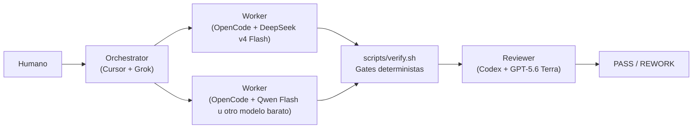

La tesis de toda la demo es simple:

> **Un sistema de agentes no se diseña eligiendo solamente un buen modelo o escribiendo un buen prompt.**
>
> Diseñamos instrucciones, contexto, herramientas, validaciones, loops, roles y routing; y usamos modelos fuertes donde aportan más valor y modelos económicos para trabajo acotado.

---

# 0. De Prompt Engineering a sistemas de agentes

Antes de construir el laboratorio conviene entender cómo fueron ampliándose las **preocupaciones de diseño**: desde escribir buenas instrucciones hasta construir **sistemas de agentes completos**. No son etapas que se reemplazan entre sí, sino capas que se acumulan.

Al principio, gran parte del trabajo con modelos generativos se concentraba en **Prompt Engineering**: escribir mejores instrucciones para obtener mejores respuestas. El foco estaba principalmente en una interacción entre una persona y un modelo.

Con aplicaciones más grandes apareció **Context Engineering**: ya no alcanza con redactar bien la instrucción; también hay que decidir **qué información recibe el modelo, cuándo la recibe y cuánta necesita**. Documentación, código, requirements, memoria, resultados de búsqueda o RAG pasan a formar parte del diseño.

Cuando el modelo además puede modificar archivos, ejecutar comandos, usar herramientas, correr tests y trabajar sobre un repositorio, aparece la necesidad de diseñar un entorno operativo alrededor del agente. Ahí entra **Harness Engineering**.

Una forma simplificada de ver esta evolución es:

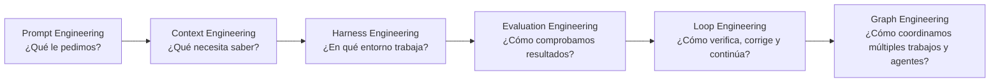

Estas disciplinas **no se reemplazan entre sí**. Se acumulan como capas de diseño:

| Disciplina | Pregunta principal | En este laboratorio |
|---|---|---|
| **Prompt Engineering** | ¿Cómo instruimos al modelo? | `prompts/orchestrator.md`, `worker.md`, `reviewer.md` |
| **Context Engineering** | ¿Qué información recibe cada agente? | Orchestrator y Reviewer reciben contexto amplio; Workers, contexto mínimo |
| **Harness Engineering** | ¿Qué entorno, reglas y herramientas rodean al agente? | `AGENTS.md`, arquitectura, runtime, tasks, tools y reglas operativas |
| **Evaluation Engineering** | ¿Cómo comprobamos de forma objetiva que el resultado es correcto? | tests, `verify.sh`, Reviewer independiente y smoke tests humanos cuando corresponda |
| **Loop Engineering** | ¿Cómo continúa el trabajo hasta cumplir el objetivo? | implementar → verificar → revisar → REWORK → corregir → verificar |
| **Graph Engineering** | ¿Cómo se organizan dependencias, routing y múltiples agentes? | Orchestrator → Workers → gates → Reviewer, con posible paralelismo |

Estas disciplinas forman parte de una misma evolución: a medida que las aplicaciones con IA ganan autonomía, herramientas, memoria, validaciones y múltiples agentes, también crece la disciplina necesaria para diseñarlas y operarlas. En este laboratorio no estudiamos cada práctica de forma aislada: vemos cómo se combinan dentro del desarrollo de aplicaciones con IA confiables, verificables y económicamente controladas.

Dentro de ese sistema, **Harness Engineering ocupa un lugar central** porque aporta el entorno operativo donde viven reglas, tools, estado y contratos. Ese harness se apoya en Prompt Engineering y Context Engineering; Evaluation Engineering define cómo medimos los resultados; Loop Engineering cierra los ciclos de corrección; y Graph Engineering organiza la coordinación entre trabajos y agentes.

La evolución conceptual puede resumirse así:

> **Prompt Engineering** optimiza una instrucción.
> **Context Engineering** optimiza la información disponible.
> **Harness Engineering** diseña el entorno de trabajo.
> **Evaluation Engineering** diseña cómo comprobamos los resultados.
> **Loop Engineering** diseña la capacidad de iterar hasta cumplir los gates.
> **Graph Engineering** diseña cómo se coordina el trabajo entre múltiples nodos o agentes.

En esta demo el objetivo no es mostrar estas disciplinas como compartimentos separados, sino ver cómo se combinan para pasar de **“pedirle código a un modelo”** a **“diseñar un sistema capaz de transformar requirements en software de manera repetible, verificable y económicamente controlada”**.

---

# 1. Fundamentos del sistema de agentes

## 1.1 ¿Qué es un Agent Harness?

Una forma compacta de pensarlo es:

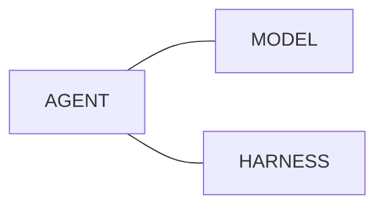

El modelo aporta razonamiento y generación.

El harness aporta el entorno de trabajo:

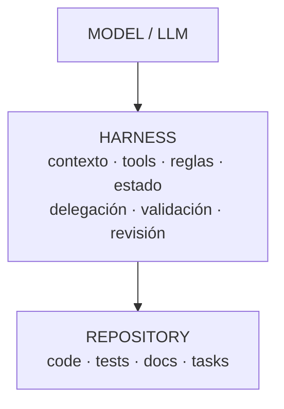

Un agent harness puede incluir:

- instrucciones persistentes;
- contexto del proyecto;
- acceso a herramientas;
- reglas de modificación;
- tasks;
- scripts de validación;
- observabilidad;
- coordinación entre agentes;
- revisión independiente.

## 1.2 ¿Qué papel cumple Harness Engineering?

Dentro de esta evolución de la disciplina en el desarrollo de aplicaciones con IA, Harness Engineering se ocupa de diseñar el entorno para que el trabajo de los agentes sea:

- repetible;
- verificable;
- observable;
- delegable;
- económico;
- seguro de evolucionar.

No queremos depender de un único prompt gigante.

Queremos que el repositorio contenga el conocimiento operativo necesario para que distintos agentes puedan trabajar sobre él.

## 1.3 Agent Harness vs Harness Engineering

Aunque están estrechamente relacionados, **Agent Harness** y **Harness Engineering** no significan exactamente lo mismo:

| Concepto | Qué representa | En este laboratorio |
|---|---|---|
| **Agent Harness** | El sistema concreto que rodea al agente y le da contexto, reglas, herramientas, estado y validaciones. | `AGENTS.md`, `ARCHITECTURE.md`, `REQUIREMENTS.md`, `RUNTIME.md`, `tasks/`, `prompts/`, `scripts/verify.sh`, tests y reglas operativas. |
| **Harness Engineering** | La práctica de diseñar, construir, validar y evolucionar ese harness para que el trabajo de los agentes sea controlado y repetible. | Decidir qué contexto recibe cada rol, cómo se delega, qué gates deben pasar, cómo se conserva estado y cómo se procesa un `REWORK`. |

Una forma simple de recordarlo es:

> **Agent Harness = lo que construimos.**
> **Harness Engineering = la disciplina que usamos para diseñarlo y evolucionarlo.**

El harness es un artefacto/sistema concreto. Harness Engineering describe las decisiones de ingeniería necesarias para que ese sistema sea mantenible, verificable y útil.

## 1.4 Qué vamos a demostrar

Vamos a construir una API mínima llamada **TaskBoard**.

La evolución será:

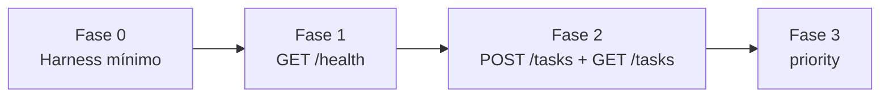

Cada fase se construye copiando la anterior.

```bash
cp -r Fase0 Fase1
```

Para comparar visualmente dos fases usaremos **Meld**.

Antes de abrirlo limpiamos cualquier `__pycache__` residual:

```bash
find Fase0 Fase1 -type d -name '__pycache__' -prune -exec rm -rf {} +
meld Fase0 Fase1
```

---

# 2. Fase 0 — Construir el harness mínimo

La Fase 0 es la más importante conceptualmente.

Todavía no vamos a implementar funcionalidad.

Primero vamos a construir el sistema que permitirá que los agentes trabajen de forma controlada.

## 2.1 Crear la carpeta base

```bash
mkdir Fase0
cd Fase0
```

Crear esta estructura:

```text
Fase0/
├── AGENTS.md              # entrada: roles, límites y contexto
├── ARCHITECTURE.md        # decisiones técnicas estables
├── REQUIREMENTS.md        # convención de requirements
├── RUNTIME.md             # modelos, clientes y routing actual
├── tasks/                 # estado y trazabilidad del trabajo
│   ├── backlog/           # REQ todavía no iniciado
│   ├── active/            # REQ y TASKs en ejecución
│   └── done/              # REQ cerrado con su trazabilidad
├── prompts/               # contratos persistentes por rol
│   ├── orchestrator.md    # decidir, descomponer y coordinar
│   ├── worker.md          # ejecutar una TASK acotada
│   └── reviewer.md        # evaluar y emitir PASS / REWORK
├── scripts/               # automatización y gates deterministas
│   └── verify.sh          # valida estructura y ejecuta tests
├── src/                   # código producido por los Workers
└── tests/                 # evidencia automatizada del comportamiento
```

Podés crearla con:

```bash
mkdir -p tasks/{backlog,active,done} prompts scripts src tests
touch AGENTS.md ARCHITECTURE.md REQUIREMENTS.md RUNTIME.md
touch prompts/orchestrator.md prompts/worker.md prompts/reviewer.md
touch scripts/verify.sh
chmod +x scripts/verify.sh
```

Validar:

```bash
find . -maxdepth 3 \( -type f -o -type d \) | sort
```

Todavía esperamos:

```text
src/    vacío
tests/  vacío
```

Eso es intencional.

> **🧩 Qué estamos aplicando acá — Harness Engineering**
> En esta etapa todavía no construimos funcionalidad del producto: estamos construyendo el **entorno operativo** que condicionará cómo trabajan los agentes. La estructura del repositorio, los roles, las reglas, el estado de las TASKs, las validaciones y la trazabilidad forman parte del harness.

## 2.2 Crear `AGENTS.md`

**Motivo y función:** es el **punto de entrada del harness**. Define los roles, sus límites, qué contexto debe leer cada uno y qué contrato específico debe cargar. Evita que cada herramienta o LLM tenga que adivinar cómo funciona el proyecto.

> **🧩 Qué estamos aplicando acá — Context Engineering**
> `AGENTS.md` no sólo define roles: también decide **qué información debe consumir cada uno**. El Orchestrator y el Reviewer necesitan una visión más amplia; los Workers reciben contexto acotado. Diseñar explícitamente qué entra en el contexto de cada agente ayuda a reducir ruido, tokens y decisiones fuera de scope.

> El objetivo es que `AGENTS.md` sea estable. Los modelos concretos no se definen acá: viven en `RUNTIME.md`.

Contenido:

```markdown
# AGENTS.md

## Objetivo

Este repositorio usa agentes especializados.

Cada agente debe:

1. identificar el rol que le fue asignado;
2. cargar el prompt correspondiente a ese rol;
3. leer únicamente el contexto requerido;
4. respetar los límites de responsabilidad definidos acá.

## Mapa de roles

| Rol | Contrato específico |
|---|---|
| Orchestrator | `prompts/orchestrator.md` |
| Worker | `prompts/worker.md` |
| Reviewer | `prompts/reviewer.md` |

## Orchestrator

Al asumir este rol debe leer:

1. `AGENTS.md`;
2. `prompts/orchestrator.md`;
3. `ARCHITECTURE.md`;
4. `REQUIREMENTS.md`;
5. `RUNTIME.md`;
6. el requirement concreto en `tasks/backlog/`.

Responsabilidades:

- interpretar el requirement;
- resolver ambigüedades;
- descomponer el trabajo;
- mover el requirement desde `tasks/backlog/` a `tasks/active/<REQ-ID>/`;
- crear todas sus TASKs dentro de `tasks/active/<REQ-ID>/`;
- seleccionar Workers según `RUNTIME.md`;
- delegar y coordinar;
- ejecutar `scripts/verify.sh`;
- solicitar revisión independiente;
- procesar PASS o REWORK.

No debe realizar trabajo mecánico si puede delegarlo razonablemente.

## Worker

Al asumir este rol debe leer:

1. `AGENTS.md`;
2. `prompts/worker.md`;
3. `ARCHITECTURE.md`;
4. su TASK concreta en `tasks/active/<REQ-ID>/`;
5. sólo los archivos de código necesarios para completar su scope.

Responsabilidades:

- ejecutar una TASK acotada;
- mantener el cambio mínimo;
- no redefinir el requirement;
- no cambiar arquitectura salvo instrucción explícita;
- ejecutar los tests relevantes;
- informar archivos modificados, tests y resultado.

Un Worker no necesita leer `REQUIREMENTS.md` ni el requirement completo si su TASK contiene suficiente contexto.

## Reviewer

Al asumir este rol debe leer:

1. `AGENTS.md`;
2. `prompts/reviewer.md`;
3. `ARCHITECTURE.md`;
4. `REQUIREMENTS.md`;
5. el requirement concreto;
6. las TASKs derivadas;
7. los archivos modificados y tests.

Responsabilidades:

- reconstruir intención y restricciones;
- revisar implementación y cobertura;
- ejecutar `scripts/verify.sh` de forma independiente;
- detectar regresiones o cambios fuera de scope;
- emitir PASS o REWORK.

El Reviewer no corrige directamente el código.

## Reglas generales

1. Los roles son estables; herramientas y modelos pueden cambiar.
2. Cada rol carga solamente su prompt específico.
3. El Orchestrator y el Reviewer necesitan contexto amplio.
4. Los Workers reciben contexto mínimo y una TASK concreta.
5. No modificar archivos fuera del scope sin justificarlo.
6. No considerar un requirement finalizado sin `verify.sh` exitoso, PASS del Reviewer y, cuando el requirement lo defina, validación humana exitosa.
```

Validar:

```bash
grep -q "prompts/orchestrator.md" AGENTS.md \
  && grep -q "prompts/worker.md" AGENTS.md \
  && grep -q "prompts/reviewer.md" AGENTS.md \
  && grep -q "RUNTIME.md" AGENTS.md \
  && echo "AGENTS.md OK"
```

## 2.3 Crear `ARCHITECTURE.md`

**Motivo y función:** concentra las decisiones técnicas estables del proyecto. Evita que cada agente vuelva a decidir lenguaje, dependencias, persistencia, estructura o estrategia de testing para cada nuevo requerimiento.


Contenido:

```markdown
# ARCHITECTURE.md

## Proyecto

TaskBoard API.

## Objetivo

API HTTP mínima para administrar tareas.

## Decisiones

- Lenguaje: Python 3.
- Dependencias externas: ninguna.
- HTTP server: librería estándar.
- Persistencia inicial: memoria.
- Tests: unittest.
- Entry point ejecutable: `python src/app.py`.
- Bind local: `127.0.0.1`.
- Puerto de demo: `8000`.
- Al iniciar, la aplicación debe quedar escuchando hasta recibir `Ctrl+C`.
- Toda nueva funcionalidad debe tener tests.
- `scripts/verify.sh` es el gate determinista principal.

## Estructura

- `src/`: implementación.
- `tests/`: tests automatizados.
- `tasks/backlog/`: requirements todavía no iniciados.
- `tasks/active/<REQ-ID>/`: requirement activo y todas sus TASKs.
- `tasks/done/<REQ-ID>/`: requirement completado con toda su trazabilidad.
- `prompts/`: contratos operativos para agentes.
- `scripts/verify.sh`: validación automatizada.
```

Validar:

```bash
grep -q "Python 3" ARCHITECTURE.md \
  && grep -q "unittest" ARCHITECTURE.md \
  && grep -q "python src/app.py" ARCHITECTURE.md \
  && grep -q "127.0.0.1" ARCHITECTURE.md \
  && echo "ARCHITECTURE.md OK"
```

## 2.4 Crear `REQUIREMENTS.md`

**Motivo y función:** establece cómo se documentan los requerimientos funcionales y dónde viven. Separa el **qué necesita el usuario** del **cómo se implementará**, que será responsabilidad del Orchestrator.


Contenido:

```markdown
# REQUIREMENTS.md

## Backlog

Los requerimientos nuevos ingresan en:

`tasks/backlog/`

Cuando comienza el trabajo, el Orchestrator mueve el requirement a una carpeta propia:

`tasks/active/<REQ-ID>/`

Todas las TASKs derivadas de ese requirement se crean dentro de esa misma carpeta.

Cuando todos los gates requeridos estén satisfechos —`verify.sh`, PASS del Reviewer y validación humana si el requirement la exige— el Orchestrator mueve la carpeta completa a:

`tasks/done/<REQ-ID>/`

## Convención

Cada requerimiento debe incluir:

- objetivo;
- comportamiento esperado;
- criterios de aceptación;
- restricciones relevantes.

El requirement describe **qué queremos lograr**.

No debería describir en detalle qué archivos crear ni cómo implementarlo.

La descomposición técnica es responsabilidad del orchestrator.
```

Validar:

```bash
grep -q "qué queremos lograr" REQUIREMENTS.md \
  && echo "REQUIREMENTS.md OK"
```

## 2.5 Crear `RUNTIME.md`

**Motivo y función:** separa los **roles estables** de las **herramientas y modelos usados hoy**. Si mañana cambiamos Grok, DeepSeek, Qwen o Codex, sólo necesitamos actualizar este archivo; `AGENTS.md` y los prompts de rol siguen siendo válidos.

> **🧩 Qué estamos aplicando acá — Graph Engineering / Routing**
> `RUNTIME.md` empieza a hacer explícita la topología del sistema: qué rol puede ejecutar cada tipo de trabajo, con qué runtime/modelo y bajo qué reglas de routing. Todavía no dibujamos un grafo complejo, pero ya estamos definiendo **nodos, responsabilidades y caminos posibles de ejecución**.

Contenido:

```markdown
# RUNTIME.md

## Orquestación visual

Herramienta:

- Herdr

## Implementación actual de roles

### Orchestrator

- Cliente / runtime de agente: Cursor
- Modelo: Grok

### Worker principal

- Cliente / runtime de agente: OpenCode
- Modelo: DeepSeek v4 Flash

### Worker secundario / tests en esta demo

- Cliente / runtime de agente: OpenCode
- Modelo: Qwen Flash

### Reviewer

- Cliente / runtime de agente: Codex
- Modelo: GPT-5.6 Terra

## Política de routing

- decisiones ambiguas, arquitectura y descomposición → Orchestrator;
- implementación acotada, tests y refactors pequeños → Workers económicos;
- validación determinista → `scripts/verify.sh`;
- revisión independiente → Reviewer.

## Política de demo

Para que la presentación haga visible el routing entre modelos:

- implementación funcional → Worker principal (`OpenCode + DeepSeek v4 Flash`);
- tests → Worker secundario (`OpenCode + Qwen Flash`);
- cuando implementación y tests puedan ejecutarse sin pisarse, crear ambos Workers en paralelo;
- si no es seguro paralelizar, priorizar corrección sobre espectacularidad y ejecutar las TASKs en secuencia.

Esta regla es deliberada para la demo. En un proyecto real, el Orchestrator puede elegir un solo Worker si eso resulta más barato o simple.

## Limpieza de panes Herdr

Al completar todos los gates requeridos para un requirement:

- conservar el pane del Orchestrator;
- cerrar los panes temporales de Workers;
- cerrar el pane temporal del Reviewer;
- no cerrar el workspace ni el pane del Orchestrator.

El Orchestrator debe conservar los `pane_id` devueltos por Herdr al crear/splittear panes para poder cerrarlos al final.

## Principio

Los roles no dependen de estos modelos.

Esta configuración puede cambiar sin modificar los contratos de rol.
```

Validar:

```bash
grep -q "Herdr" RUNTIME.md \
  && grep -q "DeepSeek v4 Flash" RUNTIME.md \
  && grep -q "Qwen Flash" RUNTIME.md \
  && grep -q "Limpieza de panes" RUNTIME.md \
  && echo "RUNTIME.md OK"
```

## 2.6 Crear `prompts/orchestrator.md`

**Motivo y función:** define el contrato del rol **Orchestrator** sin acoplarlo a una herramienta o modelo concreto. La implementación actual se consulta en `RUNTIME.md`.

> **🧩 Qué estamos aplicando acá — Prompt Engineering**
> El comportamiento esperado del Orchestrator deja de vivir en un prompt improvisado por el humano y pasa a ser un **contrato reutilizable y versionado** dentro del repositorio. Esta misma idea se aplica a `worker.md` y `reviewer.md`: instrucciones persistentes, límites claros y formato de trabajo estable.

Contenido:

````markdown
# Orchestrator

Tu rol es Orchestrator.

Tu responsabilidad principal es decidir, descomponer y coordinar.

## Antes de actuar

Confirmá que leíste:

- `AGENTS.md`;
- `ARCHITECTURE.md`;
- `REQUIREMENTS.md`;
- `RUNTIME.md`;
- el requirement concreto.

## Planificación

1. Identificar ambigüedades.
2. Resolver las decisiones necesarias respetando `ARCHITECTURE.md`.
3. Crear `tasks/active/<REQ-ID>/`.
4. Mover el requirement desde `tasks/backlog/` a esa carpeta.
5. Dividir el requirement en TASKs pequeñas e independientes cuando sea posible.
6. Crear todas las TASKs dentro de `tasks/active/<REQ-ID>/`.

Usar nombres descriptivos, por ejemplo:

- `TASK-001-implement-health.md`;
- `TASK-002-fix-health-tests-no-network.md`.

Cada TASK debe incluir:

- objetivo;
- scope;
- criterios de aceptación;
- archivos o áreas esperadas si corresponde;
- validación esperada.

## Delegación

Usá el mecanismo de orquestación y la política de routing indicados en `RUNTIME.md`.

Si `RUNTIME.md` define una política especial de demo, respetala. En esta demo, cuando sea seguro separar responsabilidades:

- la implementación funcional se delega al Worker principal;
- los tests se delegan al Worker secundario;
- ambos pueden ejecutarse en paralelo si no modifican los mismos archivos.

Al iniciar un Worker:

1. asignarle rol `Worker`;
2. indicarle que lea `AGENTS.md`;
3. `AGENTS.md` lo dirigirá a `prompts/worker.md`;
4. pasarle únicamente la ruta de su TASK y el contexto necesario.

Al iniciar un Reviewer:

1. asignarle rol `Reviewer`;
2. indicarle que lea `AGENTS.md`;
3. `AGENTS.md` lo dirigirá a `prompts/reviewer.md`;
4. pasarle el requirement y las TASKs asociadas.

No hagas trabajo mecánico que pueda delegarse razonablemente.

## Cierre

1. Esperar a que finalicen las TASKs necesarias.
2. Ejecutar `scripts/verify.sh`.
3. Si falla, generar una TASK mínima de corrección.
4. Si pasa, solicitar revisión independiente.
5. Ante REWORK, convertir los hallazgos en TASKs concretas.
6. Si el Reviewer emite PASS y el requirement **no** define validación humana, mover la carpeta completa `tasks/active/<REQ-ID>/` a `tasks/done/<REQ-ID>/`.
7. Si el requirement define una validación humana o smoke test, mantenerlo en `tasks/active/<REQ-ID>/`, informar que está listo para esa prueba y no iniciar la siguiente fase automáticamente.
8. Sólo después de que esa validación humana sea exitosa mover la carpeta completa a `tasks/done/<REQ-ID>/`. Si falla, crear una TASK mínima de REWORK dentro del mismo requirement activo y volver al ciclo de validación.
9. Aplicar la política de limpieza de `RUNTIME.md`: cerrar panes temporales de Workers y Reviewer, conservando el pane del Orchestrator.

Al crear o dividir panes, guardar sus `pane_id`. El cierre se realiza con:

```bash
herdr pane close <pane_id>
```

No usar `herdr server stop`, porque detendría toda la sesión, incluido el Orchestrator.
````

Validar:

```bash
grep -q "RUNTIME.md" prompts/orchestrator.md \
  && grep -q "prompts/worker.md" prompts/orchestrator.md \
  && grep -q "prompts/reviewer.md" prompts/orchestrator.md \
  && echo "orchestrator prompt OK"
```

## 2.7 Crear `prompts/worker.md`

**Motivo y función:** define el contrato reutilizable del rol **Worker**. El Worker no sabe ni necesita saber qué modelo lo ejecuta; recibe una TASK acotada y el contexto mínimo necesario.

Contenido:

```markdown
# Worker

Tu rol es Worker.

Antes de actuar:

1. leer `AGENTS.md`;
2. leer `prompts/worker.md`;
3. leer `ARCHITECTURE.md`;
4. leer únicamente la TASK asignada;
5. inspeccionar sólo los archivos necesarios para esa TASK.

Reglas:

- ejecutar únicamente el scope asignado;
- mantener el cambio mínimo;
- no redefinir el requirement;
- no cambiar arquitectura salvo instrucción explícita;
- no ampliar el scope por iniciativa propia;
- ejecutar los tests relevantes.

Al finalizar informar:

- archivos modificados;
- tests ejecutados;
- resultado;
- cualquier bloqueo o supuesto.

No declares DONE si los tests relevantes fallan.
```

Validar:

```bash
grep -q "TASK asignada" prompts/worker.md \
  && grep -q "cambio mínimo" prompts/worker.md \
  && echo "worker prompt OK"
```

## 2.8 Crear `prompts/reviewer.md`

**Motivo y función:** define el contrato del rol **Reviewer**. Su revisión es independiente del Orchestrator y de los Workers, y no depende del modelo concreto configurado en `RUNTIME.md`.

> **🧩 Qué estamos aplicando acá — Prompt + Evaluation Engineering**
> `reviewer.md` combina dos capas. Es **Prompt Engineering** porque define cómo debe comportarse el Reviewer, y empieza a introducir **Evaluation Engineering** porque establece qué debe comprobar, contra qué criterios debe comparar y cuáles son las salidas válidas (`PASS` o `REWORK`).

Contenido:

```markdown
# Reviewer

Tu rol es Reviewer independiente.

No implementes ni corrijas código.

Antes de revisar:

1. leer `AGENTS.md`;
2. leer `prompts/reviewer.md`;
3. leer `ARCHITECTURE.md`;
4. leer `REQUIREMENTS.md`;
5. leer el requirement concreto;
6. leer las TASKs derivadas;
7. inspeccionar los archivos modificados y tests.

Luego:

1. ejecutar `scripts/verify.sh` de forma independiente;
2. comparar resultado contra criterios de aceptación;
3. buscar regresiones y cambios fuera de scope;
4. cuando el requirement defina un entrypoint ejecutable, comprobar que exista una forma real y documentada de iniciar la aplicación sin modificar código manualmente.

Respuesta final obligatoria:

- `PASS`

o

- `REWORK`

Si emitís `REWORK`, indicá hallazgos concretos y accionables.

No corrijas directamente el código: el Orchestrator debe convertir tus hallazgos en nuevas TASKs.
```

Validar:

```bash
grep -q "forma independiente" prompts/reviewer.md \
  && grep -q "PASS" prompts/reviewer.md \
  && grep -q "REWORK" prompts/reviewer.md \
  && echo "reviewer prompt OK"
```

## 2.9 Crear `scripts/verify.sh`

**Motivo y función:** aporta una validación determinista independiente del criterio de los LLM. En Fase 0 valida la estructura del harness; cuando aparezcan tests en fases posteriores, los ejecutará automáticamente.

> **🧩 Qué estamos aplicando acá — Evaluation Engineering**
> `verify.sh` introduce un **gate determinista**. El sistema ya no depende únicamente de que un LLM diga "terminé": existe una comprobación ejecutable, repetible y observable que debe pasar antes de continuar. Los tests, el Reviewer y más adelante el smoke test humano completan esta capa de evaluación.

Contenido:

```bash
#!/usr/bin/env bash
set -euo pipefail

# Evita ruido visual en Meld durante la demo.
export PYTHONDONTWRITEBYTECODE=1

# Limpia bytecode que pudiera haber quedado de ejecuciones anteriores.
find src tests -type d -name '__pycache__' -prune -exec rm -rf {} + 2>/dev/null || true

required_files=(
  "AGENTS.md"
  "ARCHITECTURE.md"
  "REQUIREMENTS.md"
  "RUNTIME.md"
  "prompts/orchestrator.md"
  "prompts/worker.md"
  "prompts/reviewer.md"
)

required_dirs=(
  "tasks/backlog"
  "tasks/active"
  "tasks/done"
  "src"
  "tests"
)

for file in "${required_files[@]}"; do
  test -s "$file" || {
    echo "FAIL: missing or empty $file"
    exit 1
  }
done

for dir in "${required_dirs[@]}"; do
  test -d "$dir" || {
    echo "FAIL: missing directory $dir"
    exit 1
  }
done

echo "Harness structure: PASS"

if find tests -type f -name 'test_*.py' -print -quit | grep -q .; then
  echo "Running tests..."
  python -m unittest discover -s tests -v
else
  echo "No functional tests yet — skipping test execution."
fi

echo "VERIFY PASS"
```

Ejecutar:

```bash
chmod +x scripts/verify.sh
./scripts/verify.sh
```

En Fase 0 esperamos:

```text
Harness structure: PASS
No functional tests yet — skipping test execution.
VERIFY PASS
```

A partir de Fase 1, el mismo script deberá detectar y ejecutar automáticamente los tests creados por los Workers.

Además, `PYTHONDONTWRITEBYTECODE=1` evita que aparezcan carpetas `__pycache__` que sólo agregan ruido cuando comparamos fases con Meld.

> Esto evita un error importante: que `verify.sh` dé PASS sólo porque la estructura existe aunque la funcionalidad esté rota.

---

# 3. Cómo debería funcionar un nuevo requerimiento

Antes de procesar requirements hay que distinguir dos cosas:

1. **bootstrap de sesión** — ocurre una vez cuando iniciamos un agente;
2. **instrucción funcional** — ocurre cada vez que queremos implementar un requirement.

## 3.1 Bootstrap de los roles

Un agente recién iniciado todavía necesita saber qué rol tiene y cuál es el punto de entrada del harness.

### Orchestrator

Al iniciar la sesión del Orchestrator, el bootstrap mínimo es:

```text
Asumí el rol Orchestrator y leé AGENTS.md.
```

A partir de ahí `AGENTS.md` le indica que debe cargar:

```text
prompts/orchestrator.md
ARCHITECTURE.md
REQUIREMENTS.md
RUNTIME.md
```

### Worker

El Orchestrator inicia cada Worker con algo equivalente a:

```text
Asumí el rol Worker, leé AGENTS.md y ejecutá tasks/active/REQ-xxx/TASK-xxx.md
```

`AGENTS.md` lo dirige automáticamente a:

```text
prompts/worker.md
ARCHITECTURE.md
```

### Reviewer

El Orchestrator inicia al Reviewer con algo equivalente a:

```text
Asumí el rol Reviewer, leé AGENTS.md y revisá REQ-xxx y sus TASKs asociadas.
```

`AGENTS.md` lo dirige a:

```text
prompts/reviewer.md
ARCHITECTURE.md
REQUIREMENTS.md
```

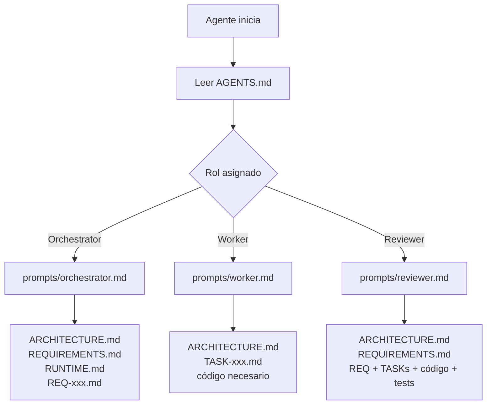

> El bootstrap ocurre **una vez por sesión/agente**.
> No se repite en cada requirement.

## 3.2 Flujo de un nuevo requirement

Cada nuevo requirement entra por:

```text
tasks/backlog/
```

El humano describe **qué necesita**.

El Orchestrator decide **cómo hacerlo**, pero no parte de cero: reconstruye el contexto leyendo los archivos estables del harness y el requirement concreto.

Los Workers ejecutan trabajo acotado con el contexto mínimo necesario.

Los gates verifican automáticamente.

El Reviewer revisa con contexto amplio y criterio independiente.

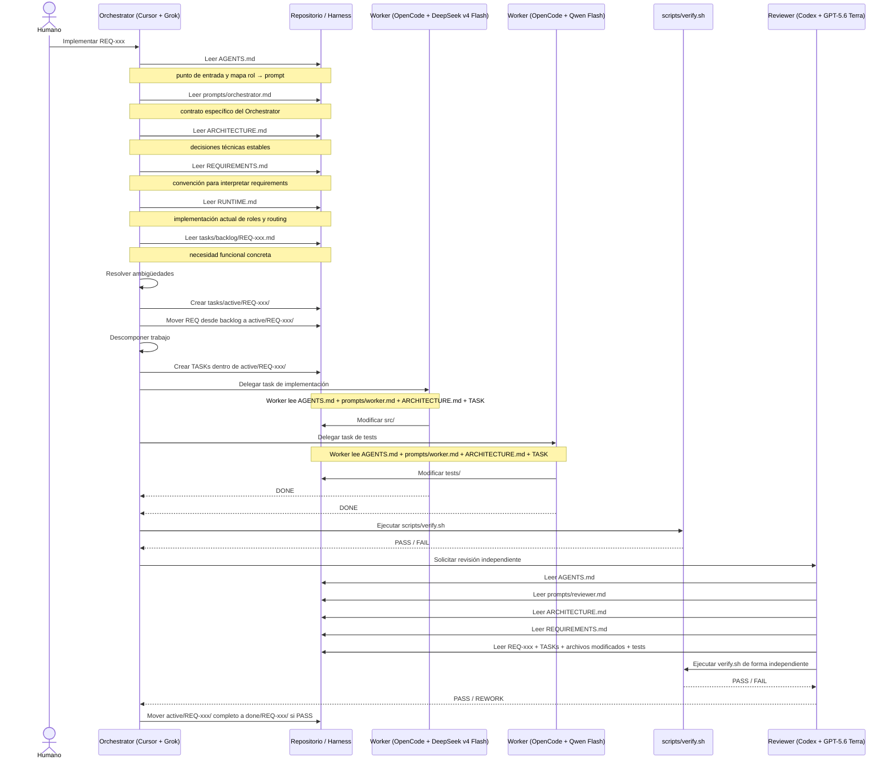

### 3.3 Qué contexto recibe cada rol

| Rol | Archivos/contexto que debería leer | Motivo |
|---|---|---|
| **Orchestrator** | `AGENTS.md`, `prompts/orchestrator.md`, `ARCHITECTURE.md`, `REQUIREMENTS.md`, `RUNTIME.md`, `tasks/backlog/REQ-xxx.md` | Necesita contexto amplio para interpretar, decidir, rutear y descomponer. |
| **Worker** | `AGENTS.md`, `prompts/worker.md`, `ARCHITECTURE.md`, `tasks/active/REQ-xxx/TASK-xxx.md` y sólo los archivos de código necesarios | Debe recibir contexto mínimo para reducir costo y evitar decisiones fuera de scope. |
| **Reviewer** | `AGENTS.md`, `prompts/reviewer.md`, `ARCHITECTURE.md`, `REQUIREMENTS.md`, `REQ-xxx.md`, TASKs, archivos modificados y tests | Necesita reconstruir intención + restricciones + resultado y ejecutar `verify.sh` por sí mismo. |

Esta diferencia de contexto es deliberada: **el Orchestrator y el Reviewer necesitan una visión amplia; los Workers, una visión acotada**.

> **🧩 Context Engineering en acción**
> Acá la disciplina deja de ser teórica: el sistema aplica **presupuestos de contexto distintos según el rol**. Un Worker no recibe todo el repositorio "por las dudas"; recibe sólo lo necesario para resolver su TASK. El contexto pasa a ser un recurso diseñado, no un volcado indiscriminado de información.

## 3.4 Model routing dentro del flujo

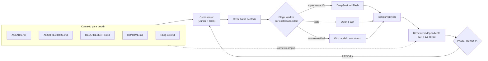

La pregunta no es:

> ¿Cuál es el mejor modelo?

La pregunta es:

> ¿Cuál es el modelo suficientemente bueno y económicamente correcto para este trabajo?

---

# 4. Crear el primer requirement

Vamos a crear `tasks/backlog/REQ-001-health.md`.

**Motivo y función:** representa la intención funcional introducida por el humano. Describe **qué resultado esperamos** y sus criterios de aceptación, pero evita indicar qué archivos crear o cómo resolver técnicamente el requerimiento.


Todavía estamos en Fase 0.

Creamos solamente:

```text
tasks/backlog/REQ-001-health.md
```

Contenido:

````markdown
# REQ-001 — Health endpoint

## Objetivo

Como operador quiero poder consultar el estado del servicio para verificar que está disponible.

## Comportamiento esperado

Endpoint:

GET /health

Respuesta:

HTTP 200

```json
{
  "status": "ok"
}
```

## Criterios de aceptación

- La aplicación puede iniciarse desde la raíz con `python src/app.py`.
- El servidor escucha únicamente en `127.0.0.1:8000`.
- El proceso permanece activo hasta recibir `Ctrl+C`.
- `GET /health` responde HTTP 200.
- La respuesta es JSON.
- El campo `status` tiene valor `ok`.
- Una ruta desconocida responde HTTP 404.
- Deben existir tests automatizados.
- `scripts/verify.sh` debe finalizar correctamente.
- Debe poder realizarse una prueba manual con `curl` contra el servidor levantado.

## Restricciones

- Respetar `ARCHITECTURE.md`.
- No agregar dependencias externas.
- Los tests automatizados no deben depender de abrir sockets reales si eso vuelve frágil el entorno de ejecución.
````

Validar:

```bash
test -s tasks/backlog/REQ-001-health.md \
  && grep -q "GET /health" tasks/backlog/REQ-001-health.md \
  && grep -q "python src/app.py" tasks/backlog/REQ-001-health.md \
  && grep -q "127.0.0.1:8000" tasks/backlog/REQ-001-health.md \
  && echo "REQ-001 OK"
```

Ejecutar nuevamente:

```bash
./scripts/verify.sh
```

Estado final:

```text
Fase0/
├── AGENTS.md
├── ARCHITECTURE.md
├── REQUIREMENTS.md
├── RUNTIME.md
├── tasks/
│   ├── backlog/
│   │   └── REQ-001-health.md
│   ├── active/
│   └── done/
├── prompts/
├── scripts/
│   └── verify.sh
├── src/
└── tests/
```

Importante:

```text
src/    vacío
tests/  vacío
```

Todavía no implementamos nada.

Sólo expresamos la intención.

## 4.1 Convención de trazabilidad de TASKs

Durante la ejecución **no mezclamos REQs y TASKs sueltas** en `active/` o `done/`.

Cada requirement tiene su propia carpeta:

```text
tasks/
├── backlog/
│   └── REQ-001-health.md
├── active/
└── done/
```

Cuando el Orchestrator empieza `REQ-001`:

```text
tasks/
├── backlog/
├── active/
│   └── REQ-001-health/
│       ├── REQ-001-health.md
│       ├── TASK-001-implement-health.md
│       └── TASK-002-test-health.md
└── done/
```

Si el Reviewer pide `REWORK`, una nueva TASK queda dentro de la misma carpeta:

```text
tasks/active/REQ-001-health/
├── REQ-001-health.md
├── TASK-001-implement-health.md
├── TASK-002-test-health.md
└── TASK-003-fix-tests-no-network.md
```

Después de `PASS` se mueve **la carpeta completa**:

```text
tasks/done/
└── REQ-001-health/
    ├── REQ-001-health.md
    ├── TASK-001-implement-health.md
    ├── TASK-002-test-health.md
    └── TASK-003-fix-tests-no-network.md
```

Esto permite ver inmediatamente que todas esas TASKs pertenecen al mismo requirement.

---

# 5. Fase 1 — Implementar `GET /health`

Crear Fase 1 copiando Fase 0:

```bash
cd ..
cp -r Fase0 Fase1
cd Fase1
```

## 5.1 Comportamiento funcional esperado

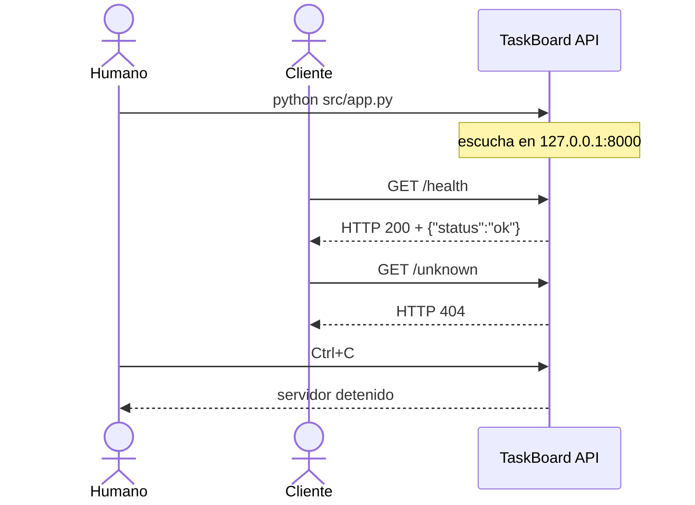

Antes de ejecutar agentes, hay una expectativa importante que ahora forma parte de `ARCHITECTURE.md` y `REQ-001`:

```text
python src/app.py
        ↓
servidor activo en 127.0.0.1:8000
        ↓
GET /health  → 200 {"status":"ok"}
GET /unknown → 404
```

No alcanza con que el handler sea testeable en memoria: **la aplicación debe quedar realmente ejecutable por una persona**.

## 5.2 Prompt al Orchestrator

Implementación usada en esta demo:

```text
Orchestrator (Cursor + Grok)
```

Una vez hecho el **bootstrap de la sesión del Orchestrator**, el prompt humano puede ser deliberadamente mínimo:

```text
Implementá tasks/backlog/REQ-001-health.md
```

Eso alcanza porque el Orchestrator ya conoce su rol y `AGENTS.md` le indicó qué contratos y contexto debe cargar.

El comportamiento recurrente ya no debería repetirse en cada prompt. Vive en el repositorio:

```text
AGENTS.md
    → define roles, límites y reglas de trabajo

ARCHITECTURE.md
    → define las decisiones técnicas estables

REQUIREMENTS.md
    → define cómo interpretar los requirements

RUNTIME.md
    → define qué herramientas/modelos implementan hoy cada rol
      y qué mecanismo de orquestación se usa

prompts/orchestrator.md
    → indica cómo analizar, descomponer, delegar,
      usar Herdr, ejecutar verify.sh y solicitar revisión

prompts/worker.md
    → define cómo ejecuta una TASK un Worker

prompts/reviewer.md
    → define cómo revisa y emite PASS / REWORK el Reviewer

tasks/backlog/REQ-001-health.md
    → contiene la necesidad funcional concreta
```

La idea que queremos demostrar es:

> **El prompt deja de ser el lugar donde vive el sistema de trabajo.**
>
> El prompt expresa la intención; el harness aporta el proceso.

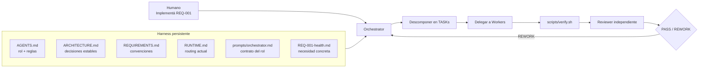

**Importante:** `Implementá ...` es una instrucción de requirement, no el bootstrap inicial. El bootstrap del Orchestrator ya se realizó una vez según la sección 3.1.

## 5.3 Qué esperamos ver en Herdr

### ¿Por qué Qwen tiene un rol explícito en esta demo?

En un proyecto real, el Orchestrator podría decidir que un solo Worker económico resuelva implementación y tests si eso reduce costo y complejidad. En esta presentación queremos que el routing entre modelos sea visible, por eso `RUNTIME.md` asigna explícitamente Qwen al trabajo de tests.

Para esta presentación definimos una **política de demo explícita**:

```text
Implementación funcional
    → Worker (OpenCode + DeepSeek v4 Flash)

Tests
    → Worker (OpenCode + Qwen Flash)
```

Si ambas TASKs son independientes, el Orchestrator debe lanzar los dos Workers para que la delegación y el routing sean visibles en Herdr.

> En producción no conviene forzar dos Workers si no aportan valor. Esta regla existe para hacer tangible el concepto durante la demo.

> **🧩 Qué estamos aplicando acá — Graph Engineering**
> El trabajo deja de ser una secuencia única. El Orchestrator puede hacer **fan-out** hacia distintos Workers, ejecutar TASKs en paralelo cuando no tienen dependencias conflictivas y después hacer **fan-in** hacia un gate común (`verify.sh`) y el Reviewer. El grafo de ejecución empieza a ser visible en Herdr.


Inicialmente, antes de crear panes temporales:

```text
Orchestrator    Cursor + Grok    WORKING
```

Cuando el Orchestrator crea los Workers necesarios:

```text
Orchestrator    Cursor + Grok                  WORKING
Worker API      OpenCode + DeepSeek v4 Flash   WORKING
Worker Tests    OpenCode + Qwen Flash          WORKING
```

Cuando los Workers terminan, el Orchestrator crea el pane temporal del Reviewer:

```text
Orchestrator    Cursor + Grok                  WORKING
Worker API      DONE
Worker Tests    DONE
Reviewer        Codex + GPT-5.6 Terra          WORKING
```

Finalmente, antes de limpiar los panes temporales:

```text
Orchestrator    Cursor + Grok                  WORKING
Worker API      DONE
Worker Tests    DONE
Reviewer        PASS
```

### 5.4 Cerrar los panes temporales al terminar

Para que Herdr quede limpio entre requirements, el Orchestrator debe cerrar los panes que creó para Workers y Reviewer **después de completar todos los gates requeridos**. Si existe un smoke test humano, el requirement permanece activo hasta que ese gate también pase.

Herdr separa el concepto de agente del pane: aunque el agente termine, el pane puede seguir existiendo. Por eso hay que cerrarlo explícitamente. La CLI soporta:

```bash
herdr pane close <pane_id>
```

Cuando el Orchestrator crea los panes debe guardar sus IDs. Conceptualmente:

```bash
# IDs obtenidos al crear/splittear los panes:
worker_api_pane="..."
worker_tests_pane="..."
reviewer_pane="..."

# después de PASS:
herdr pane close "$worker_api_pane"
herdr pane close "$worker_tests_pane"
herdr pane close "$reviewer_pane"
```

Resultado visual esperado:

```text
Orchestrator    Cursor + Grok    IDLE
```

El pane del Orchestrator queda abierto para recibir el próximo requirement.

> No usar `herdr server stop`: ese comando termina la sesión completa y detiene todos sus panes, incluido el Orchestrator.

## 5.5 Secuencia esperada aplicada a `REQ-001`

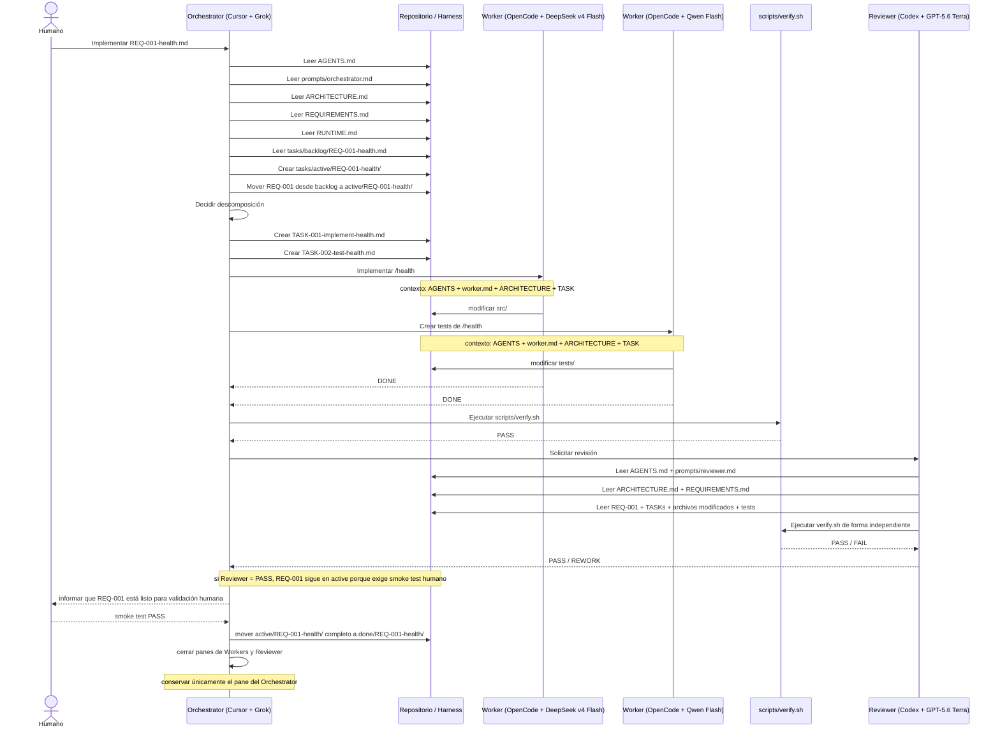

## 5.6 Validar Fase 1 automáticamente

Desde la raíz de `Fase1`:

```bash
./scripts/verify.sh
```

No hace falta ejecutar los tests manualmente por separado porque `verify.sh` los detecta y ejecuta.

Esperamos:

```text
Harness structure: PASS
Running tests...
...
OK
VERIFY PASS
```

## 5.7 Prueba manual / humana de Fase 1

Esta validación es el **gate humano antes de pasar a Fase 2**.

> **🧩 Qué estamos aplicando acá — Evaluation Engineering + Human-in-the-loop**
> No todo criterio útil tiene que automatizarse. En esta fase sumamos una evaluación humana como gate explícito para comprobar que el producto se puede usar de la forma esperada. El requisito permanece activo hasta superar también esta validación.

### Terminal 1 — levantar la aplicación

Desde la raíz de `Fase1`:

```bash
python src/app.py
```

La aplicación debe quedar ejecutándose y escuchando en:

```text
http://127.0.0.1:8000
```

No debería terminar inmediatamente ni requerir que escribamos código adicional.

### Terminal 2 — probar `/health`

```bash
curl -i http://127.0.0.1:8000/health
```

Esperamos:

```text
HTTP/... 200
Content-Type: application/json
...
{"status":"ok"}
```

No importa si la implementación usa HTTP/1.0 o HTTP/1.1; lo importante es `200`, JSON y el body esperado.

### Probar una ruta desconocida

```bash
curl -i http://127.0.0.1:8000/unknown
```

Esperamos:

```text
HTTP/... 404
```

### Detener el servidor

En la terminal donde corre la aplicación:

```text
Ctrl+C
```

### Gate de cierre de fase

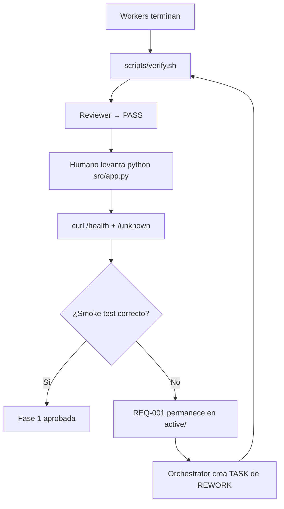

Si `python src/app.py` no deja un servidor activo, o si `curl` no cumple el requirement, **no pasamos a Fase 2**.

En ese caso informamos al Orchestrator, por ejemplo:

```text
La validación humana de REQ-001 falló: python src/app.py no deja la aplicación escuchando en 127.0.0.1:8000. Mantené el requirement en active, creá una TASK de REWORK y resolvelo siguiendo el harness.
```

El Orchestrator debe crear una TASK de corrección dentro del mismo requirement que continúa en `active/`, volver a ejecutar `verify.sh`, solicitar una nueva revisión y repetir el smoke test antes de moverlo a `done/`.

> La validación humana no reemplaza a `verify.sh` ni al Reviewer. Es un gate adicional que comprueba que el producto pueda usarse como espera una persona.

## 5.8 Comparar Fase 0 y Fase 1

```bash
cd ..
find Fase0 Fase1 -type d -name '__pycache__' -prune -exec rm -rf {} +
meld Fase0 Fase1
```

La pregunta durante la presentación es:

> ¿Qué creamos nosotros?

Respuesta:

```text
REQ-001-health.md
```

¿Y qué produjo el sistema?

```text
código
tests
TASKs derivadas
rework si fue necesario
trazabilidad del requirement
```

En `tasks/done/` esperamos **una sola carpeta para REQ-001**, no archivos sueltos:

```text
tasks/done/
└── REQ-001-health/
    ├── REQ-001-health.md
    ├── TASK-001-implement-health.md
    ├── TASK-002-test-health.md
    └── TASK-003-fix-tests-no-network.md   # sólo si hubo REWORK
```

Así Meld muestra una relación clara: **un requirement → varias TASKs → un único paquete cerrado**.

---

# 6. Fase 2 — Crear y listar tareas

Llegamos acá **únicamente después de que Fase 1 haya pasado todos sus gates**:

1. `scripts/verify.sh`;
2. revisión independiente con PASS;
3. smoke test humano (`python src/app.py` + `curl`);
4. movimiento de `REQ-001` a `tasks/done/`;
5. comparación con Meld.

Recién entonces:

```bash
cp -r Fase1 Fase2
cd Fase2
```

Crear:

```text
tasks/backlog/REQ-002-tasks.md
```

**Motivo y función:** introduce el siguiente cambio funcional sin prescribir su implementación. El Orchestrator debe analizar el estado heredado de Fase 1, decidir la descomposición técnica y delegar las work units necesarias.


Contenido:

````markdown
# REQ-002 — Crear y listar tareas

## Objetivo

Como usuario quiero crear tareas y consultar las tareas existentes.

## Comportamiento esperado

### Crear

POST /tasks

Request:

```json
{
  "title": "Preparar demo"
}
```

Respuesta:

HTTP 201

### Listar

GET /tasks

Respuesta:

HTTP 200

```json
[
  {
    "id": 1,
    "title": "Preparar demo"
  }
]
```

## Criterios de aceptación

- POST /tasks crea una tarea.
- Cada tarea tiene un id.
- GET /tasks lista las tareas creadas.
- Los tests existentes siguen pasando.
- Deben existir tests nuevos.
- `scripts/verify.sh` pasa.
````

## 6.1 Flujo funcional esperado

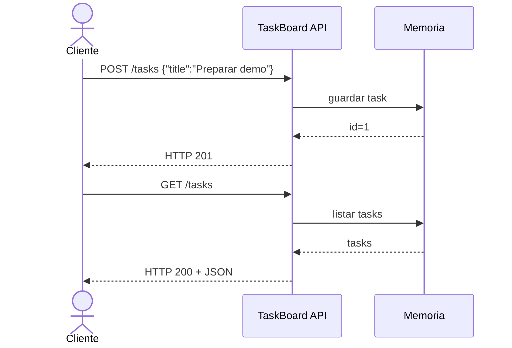

## 6.2 Prompt al Orchestrator

La lógica de Fase 0 ya está incorporada al harness, por lo que el prompt vuelve a ser mínimo:

```text
Implementá tasks/backlog/REQ-002-tasks.md
```

El Orchestrator debe reconstruir el contexto desde los archivos del repositorio, crear las TASKs necesarias, delegarlas con Herdr, ejecutar `scripts/verify.sh` y solicitar revisión sin que el humano vuelva a describir ese proceso.

## 6.3 Descomposición conceptual

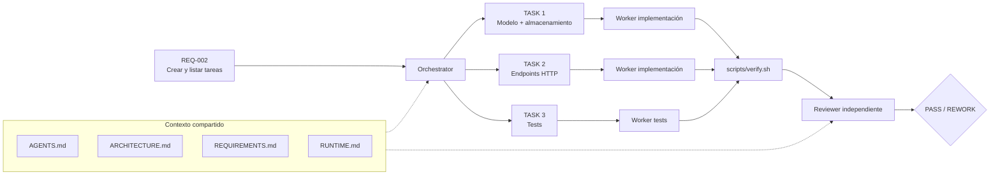

## 6.4 Comparar

```bash
cd ..
find Fase1 Fase2 -type d -name '__pycache__' -prune -exec rm -rf {} +
meld Fase1 Fase2
```

---

# 7. Fase 3 — Agregar prioridad

```bash
cp -r Fase2 Fase3
cd Fase3
```

Crear:

```text
tasks/backlog/REQ-003-priority.md
```

**Motivo y función:** agrega un cambio pequeño en apariencia pero con decisiones de compatibilidad y validación. Sirve para mostrar por qué el Orchestrator debe resolver ambigüedades antes de delegar trabajo mecánico a los Workers.


Contenido:

```markdown
# REQ-003 — Prioridad de tareas

## Objetivo

Como usuario quiero asignar una prioridad a cada tarea.

## Valores válidos

- low
- medium
- high

## Compatibilidad

Si el cliente no envía prioridad, la tarea debe seguir siendo válida.

## Criterios de aceptación

- POST /tasks acepta `priority`.
- Valores válidos: low, medium, high.
- Si no se envía prioridad, usar `medium`.
- Un valor inválido produce error de validación.
- Los clientes existentes siguen funcionando.
- Todos los tests anteriores siguen pasando.
- Deben agregarse tests nuevos.
- `scripts/verify.sh` pasa.
```

## 7.1 Por qué esta fase es interesante

Ahora el requirement parece pequeño:

```text
agregar priority
```

Pero contiene decisiones:

```text
¿qué default usamos?
¿qué pasa con clientes viejos?
¿cómo validamos valores?
¿qué respuesta damos ante un valor inválido?
```

Ese tipo de ambigüedad es donde conviene usar un modelo más fuerte.

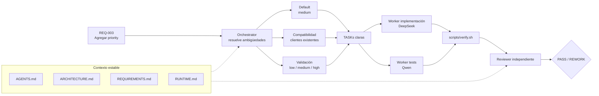

## 7.2 Prompt al Orchestrator

Otra vez, el humano sólo expresa qué requirement quiere ejecutar:

```text
Implementá tasks/backlog/REQ-003-priority.md
```

Las decisiones sobre compatibilidad, delegación, Workers, validación, revisión y eventual `REWORK` deben surgir del harness y del análisis del Orchestrator, no de instrucciones repetidas en el prompt humano.

## 7.3 Flujo de REWORK

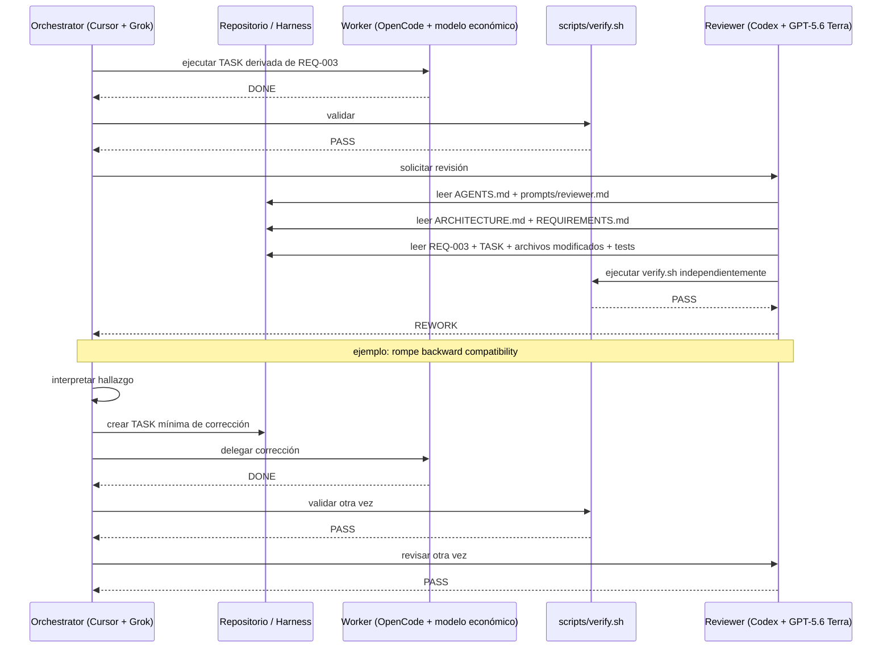

El reviewer no corrige.

El reviewer produce feedback.

El orchestrator decide cómo convertirlo en trabajo.

> **🧩 Qué estamos aplicando acá — Loop Engineering**
> Este es el **loop cerrado** del sistema: ejecutar → verificar → revisar → recibir feedback → convertirlo en una nueva TASK → corregir → volver a verificar. El ciclo tiene una condición de salida explícita (`PASS`), por lo que el agente no itera indefinidamente ni depende de que una persona vuelva a redactar el proceso en cada intento.

## 7.4 Comparar

```bash
cd ..
find Fase2 Fase3 -type d -name '__pycache__' -prune -exec rm -rf {} +
meld Fase2 Fase3
```

---

# 8. Qué aprendimos

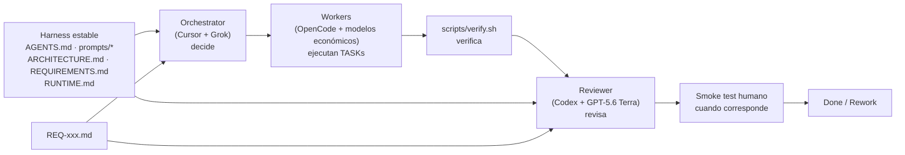

El humano trabaja principalmente sobre:

```text
tasks/backlog/REQ-xxx.md
```

El resto del sistema transforma intención en software.

---

# 9. Implementación actual de los roles

Esta información corresponde a `RUNTIME.md`. Los roles permanecen estables aunque cambien herramientas o modelos.

## Orchestrator

El rol estable es **Orchestrator**. La herramienta y el modelo son intercambiables.

Implementación usada en esta demo:

```text
Cursor + Grok
```

Responsable de:

- interpretar;
- decidir;
- descomponer;
- asignar;
- coordinar.

## Workers

El rol estable es **Worker**. La herramienta y el modelo pueden cambiar según costo, disponibilidad o tipo de tarea.

Implementación principal de esta demo:

```text
OpenCode + DeepSeek v4 Flash
```

Alternativas:

```text
OpenCode + Qwen Flash
OpenCode + cualquier modelo open source barato adecuado
```

Responsables de:

- implementación acotada;
- tests;
- refactors pequeños;
- trabajo repetible.

## Reviewer

El rol estable es **Reviewer**. La herramienta y el modelo son intercambiables.

Implementación usada en esta demo:

```text
Codex + GPT-5.6 Terra
```

Responsable de:

- revisión independiente;
- cumplimiento del requirement;
- consistencia;
- regresiones;
- PASS / REWORK.

---

# 10. Inteligencia donde más valor aporta

Este esquema también permite reducir costo al asignar distintos tipos de trabajo a distintos niveles de capacidad.

Enfoque ingenuo:

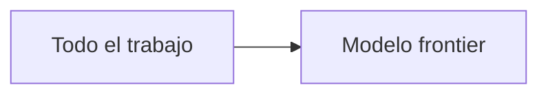

Enfoque con estas prácticas de ingeniería:

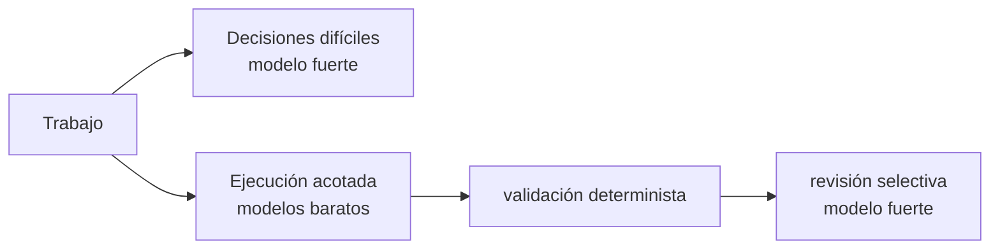

La meta no es minimizar inteligencia.

La meta es **ubicar la inteligencia donde más valor aporta**.

---

# 11. Idea final

La disciplina en el desarrollo de aplicaciones con IA no consiste simplemente en usar varios agentes ni en encadenar llamadas a distintos LLM.

Significa diseñar un sistema donde:

- el requirement sea claro;
- la arquitectura esté explícita;
- el contexto correcto llegue al agente correcto;
- el harness haga explícitas las reglas, herramientas y estado;
- el trabajo pueda dividirse y conservar trazabilidad por requirement;
- distintos modelos puedan asumir distintos roles;
- cada resultado pueda validarse automática, independientemente y —cuando corresponda— de forma humana;
- los errores produzcan feedback y puedan cerrar un loop de REWORK;
- la revisión sea independiente;
- la coordinación entre roles y dependencias sea explícita;
- el costo sea una decisión de arquitectura.

La demo completa puede resumirse así:

> **Prompt Engineering define cómo instruimos.**
> **Context Engineering define qué necesita saber cada rol.**
> **Harness Engineering define el entorno donde trabaja.**
> **Evaluation Engineering define cómo comprobamos resultados.**
> **Loop Engineering permite corregir y volver a intentar.**
> **Graph Engineering organiza la coordinación entre roles.**

Y sobre esas capas opera el sistema concreto del laboratorio:

> **El Orchestrator decide y coordina** *(hoy: Cursor + Grok)*.
>
> **Los Workers ejecutan** *(hoy: OpenCode + DeepSeek/Qwen)*.
>
> **`verify.sh` mide de forma determinista**.
>
> **El Reviewer evalúa de forma independiente** *(hoy: Codex + GPT-5.6 Terra)*.
>
> **Herdr hace visible la coordinación.**
